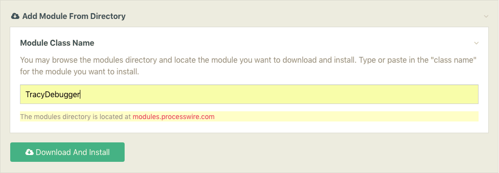

# Introduction

## About
Tracy Debugger for ProcessWire is a highly configurable debugging and development tool. Built on top of Tracy by Nette, it adds [30+ custom panels/tools](debug-bar.md) that will dramatically reduce your ProcessWire learning curve and speed up your development time.

[ProcessWire](https://processwire.com)

A PHP framework and headless content management system that lets you work the way you want - no fighting the system to your will!

* self-hosted
* all custom fields
* jQuery-inspired API
* powerful selector engine

[Tracy Nette](https://tracy.nette.org/)

The Tracy library is a useful helper for everyday PHP programmers. It helps you to:
* quickly detect and correct errors
* log errors
* dump variables
* measure execution time and memory consumption

## Installation
The recommended way to install is via the ProcessWire modules interface: ** Modules > Site > Add New **

## Getting Started
If you are on a local development setup and you are logged in as a superuser the debug bar will show automatically. If you are on a live site, you will need to go into the [config settings](configuration.md).

Tracy will automatically show notices, warnings, and errors and you will be able to make manual `bd()` "barDump" calls to easily debug variables, objects, and arrays.

That's the basics, but there is much more to explore, so be sure to read through the rest of the docs.

## Acknowledgements
Firstly, I want to send out a big thanks to [@tpr](https://processwire.com/talk/profile/3156-tpr/) / [@rolandtoth](https://github.com/rolandtoth/) for introducing me to Tracy and for the idea for this module and for significant feedback, testing, and feature suggestions. Many other ProcessWire forum members have also been instrumental in testing - it has been a real community effort to get everything working on all systems. Thank you everyone!
