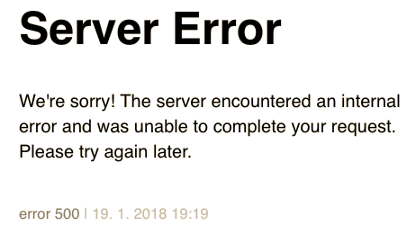
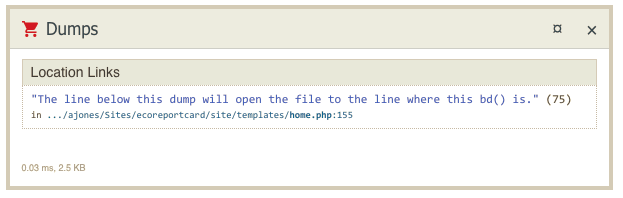
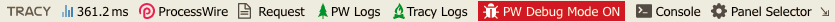
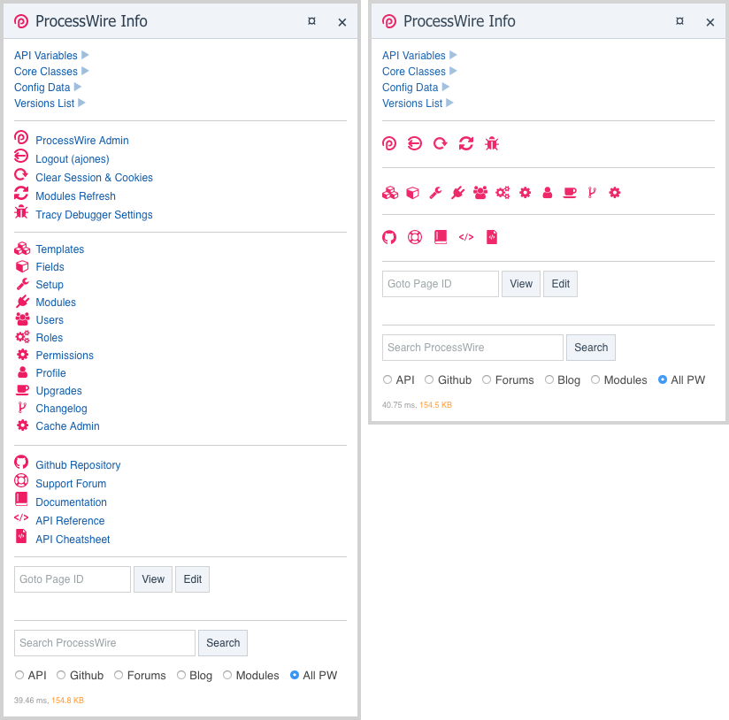

# Configuration

## Main setup

##### Enable Tracy Debugger

> Uncheck to completely disable all Tracy Debugger features.

```
@options: enabled | disabled

@default: enabled
```
* You can also disable Tracy via the PW API with: `$config->tracyDisabled = true;`
* If disabled, a few tiny dummy classes will be loaded instead to ensure any debug calls, eg `bd()` etc don't cause errors.

##### Output mode

> What mode Tracy is in for superusers and other authorized users.

```
@options: DETECT | DEVELOPMENT | PRODUCTION

@default: DETECT
```

* This setting only affects superusers and other users with the `tracy-debugger` permission.
* All other users and guests will always be forced into the safe PRODUCTION mode.

**DETECT**
* automatically switches to DEVELOPMEMT or PRODUCTION if server is local or live (by IP address)

**DEVELOPMENT**
* **enables debug bar**
* shows the Tracy [BlueScreen](other-tools.md#bluescreen) for fatal errors

**PRODUCTION**
* **disables debug bar**
* all notices/warnings are hidden from view, but logged to file
* optionally send an email whenever an error is logged
* fatal errors are displayed like this:



***

## Access permissions

##### Force superusers into development mode

> Check to force DEVELOPMENT mode for superusers even on live sites.

```
@options: enabled | disabled

@default: enabled
```

* By default, the Output Mode setting's DETECT option will force a site into PRODUCTION mode when it is live, which hides the DebugBar and sends errors and dumps to log files. However, with this checked, superusers will always be in DEVELOPMENT mode.

##### Force guest users into development mode on localhost

> Check to force DEVELOPMENT mode for guests (and other users without the `tracy-debugger` permission) when server detected as localhost.

```
@options: enabled | disabled

@default: enabled
```

* By default, guest users will always be in PRODUCTION mode (no debug bar). However, with this checked, they will always be in DEVELOPMENT mode on localhost.

##### Restrict non-superusers

> IP Address that non-superusers need to use TracyDebugger.

```
@param: IP address or a PCRE regular expression
```

* Enter IP address or a PCRE regular expression to match IP address of user, eg. /^123\.456\.789\./ would match all IP addresses that started with 123.456.789.

* Non-superusers are already blocked unless they have the "tracy-debugger" permission. But once a user has been given the permission, this option restricts access to the listed IP address. Highly recommended for debugging live sites that you have manually set into DEVELOPMENT mode.

***

## Miscellaneous

##### Strict mode

> Displays notices and warnings like errors

* Check to enable strict mode which displays notices and warnings like errors - this results in the Tracy [BlueScreen](other-tools.md#bluescreen) which shows the full stack trace of the error. This setting can also be toggled on/off from the [Panel Selector](debug-bar.md#panel-selector) as needed.

##### Strict mode AJAX only

> Enables strict mode only for AJAX calls.

* Because Tracy intercepts notices and warnings, these will no longer be returned with the AJAX response which may result in a "success" reponse, rather than "failure". Notices and warnings from an AJAX call will be displayed in the AJAX bar's Errors panel, but you still might prefer this option as it provides a more prominent indication of failure.

##### Force scream

> Disables the @ (silence/shut-up) operator so those notices and warnings are no longer hidden.

* This is disabled when Strict Mode is enabled because of a [bug](https://forum.nette.org/en/25569-strict-and-scream-modes-together)? in the core Tracy package.

##### Show locations

> Shows the location of dump() and barDump() calls.



```
@options: LOCATION_SOURCE | LOCATION_LINK | LOCATION_CLASS

@default: all enabled
```

* LOCATION_SOURCE adds tooltip with path to the file, where the function was called.

* LOCATION_LINK adds a link to the file which can be opened directly.

* LOCATION_CLASS adds a tooltip to every dumped object containing path to the file, in which the object's class is defined.

##### Maximum nesting depth

> Set the maximum nesting depth of dumped arrays and objects using `dump()` and `barDump()`

```
@default: 3
```

* Warning: making this too large can slow your page load down or even crash your browser.

* Rather than adjusting this, consider using `barDumpBig()`, setting the `maxDepth` and `maxLength` in the options for the call, or using `barDumpLive()`

##### Maxiumum string length

> Set the maximum displayed strings length using `dump()` and `barDump()`

```
@default: 150
```

* Rather than adjusting this, consider using `barDumpBig()`, setting the `maxDepth` and `maxLength` in the options for the call, or using `barDumpLive()`

##### Send data to FireLogger

> When checked, certain errors and fl() calls will be sent to FireLogger in the browser console.

```
@options: enabled | disabled

@default: enabled
```

* If you are running on nginx and don't have access to adjust `fastcgi_buffers` and `fastcgi_buffer_size` settings, you may want to uncheck this to avoid 502 bad gateway errors because of `upstream sent too big header while reading response header from upstream` issues.


##### Reference page being edited

> Reference page being edited, rather than the admin edit page process

```
@options: enabled | disabled

@default: enabled
```

* When editing a page in the admin, the Request Info Panel will show details of the page being edited, and the Consol Panel will assign the $page variable to the page being edited.

* Highly recommended unless you have a reason not to do this.

***

## Error Logging

##### Log severity

> Determines which PHP errors Tracy will log

```
@options: E_ERROR | E_WARNING | E_PARSE | E_NOTICE | E_CORE_ERROR | E_CORE_WARNING |
E_COMPILE_ERROR | E_COMPILE_WARNING | E_USER_ERROR | E_USER_WARNING | E_USER_NOTICE |
E_STRICT | E_RECOVERABLE_ERROR | E_DEPRECATED | E_USER_DEPRECATED | E_ALL

@default: none
```

* These only affect log file content, not onscreen debug info

##### Email for production errors

> Receive emails at this address when an error occurs in production mode.

```
@param: email address
```

* Leave blank to log to file (/site/assets/logs/tracy/) without being notified

##### Clear email sent flag

> Check and save settings to remove the "email-sent" file so that you will start receiving new error emails.

```
@options: enabled | disabled

@default: disabled
```

* Once an email has been sent, further errors will not be emailed until you do this. This prevents flooding of your email inbox.

***

## Debug bar and panels

##### Show debug bar

> Whether the debug bar should be shown on the frontend, backend, or both

```
@options: Frontend | Backend

@default: both
```

##### No debug bar in ...

> Debug bar is removed from certain modals and iframes by default for visual reasons, but enable them if you need to debug something specific

```
@options: Regular modal | Inline modal | Overlay panels | Form Builder iframe

@default: Regular modal | Inline modal | Overlay panels
```

##### No debug bar in selected templates

> Disable the debug bar on pages with the selected templates.

* Choose whichever templates are relevant to your specific needs.

##### Hide debug bar by default

> Hide the debug bar by default on page load

```
@options: enabled | disabled

@default: disabled
```

* This results in the bar being hidden (unless an error is reported), and replaced with a small "show bar" ⇱ icon.
* Alternatively, you can trigger a session lasting hide at runtime without this setting, but clicking the ⇲ icon on the debug bar.

##### Show panel labels

> Adds labels to each panel icon in the debug bar



```
@options: enabled | disabled

@default: disabled
```

* May take up too much horizontal space if you have lots of panels enabled, or on smaller screens

##### Starting zIndex for panels

```
@default: 100
```

* Adjust if you find panels are below/above elements that you don't want.

##### Frontend panels

* Determines which panels are shown in the Debug Bar on the frontend. Sort to match order of panels in Debugger Bar.

##### Backend panels

* Determines which panels are shown in the Debug Bar on the backend. Sort to match order of panels in Debugger Bar.

* Note that some panels are intentionally missing from this list because they have no use in the backend.

##### Disabled panels for restricted users

* Check the panels that should NOT be shown to users with the "tracy-restricted-panels" role or permission.

* Unchecked panels will still only be shown to restricted users if they are selected in the Front/Back-end options above.

***

## Editor links

##### Editor protocol handler

```
@default: vscode://file/%file:%line
```

* All links from Tracy error messages and the custom ProcessWire Info Panel can be set up to open the file in your favorite code editor directly to the line of the error. By default the module is configured to work with VSCode, but it can be configured to work with pretty much any editor out there. Instructions for these are currently littered throughout the module's support thread, so do a search for your editor in there and if you can't find it, please feel free to add instructions yourself. So far, we have it confirmed as working in Sublime, Eclipse, PHPStorm, and UltraEdit.

* In addition to configuring this module, you will most likely also need to register an appropriate protocol handler on your computer. If you happen to be on a Mac and use SublimeText, [this one](https://github.com/saetia/sublime-url-protocol-mac) works perfectly, but a quick Google should find alternatives that suit your platform and code editor.

* The Tracy website also has [additional useful information](https://pla.nette.org/en/how-open-files-in-ide-from-debugger) about this.

* This approach only works for OSX. For more instructions on Windows and Linux alternatives, [read here](https://pla.nette.org/en/how-open-files-in-ide-from-debugger).

##### Local root path

* Maps editor links from live site to local dev files. Only used if you are viewing a live site, otherwise it is ignored.

* An example path on MacOS might be: /Users/myname/Sites/sitefolder/

##### Use online editor for links

```
@options: Live | Local

@default: none
```

* This will open links in an online editor instead of your code editor.

##### Online editor

```
@options: Tracy File Editor | ProcessFileEdit

@default: Tracy File Editor
```

* Which online editor to use: Tracy File Editor or [ProcessFileEdit](http://modules.processwire.com/modules/process-file-edit/).

##### Force editor links to use Tracy File Editor

```
@options: enabled | disabled

@default: enabled
```

* Even if neither of the "Use Online Editor for Links" options are checked, if the File Editor Panel is enabled, all links will be sent to it.

* RECOMMENDED: This is a handy option if you generally want links to use your code editor, but want the option to use the File Editor occasionally.
You can enable it (once or sticky) from the Panel selector on the debug bar without the need to change the above settings.

***

## File Editor panel

##### Base directory

> The highest level directory that will be shown. You won't be able to access files above this.

```
@options: Root | Site | Templates

@default: Templates
```

* A more specific selection results in better performance in the File Editor Panel.

##### Allowed extensions

> List of extensions that can be opened in the editor. Fewer extensions results in better performance in the File Editor panel.

```
@default: php, module, js, css, htaccess, latte
```

***

## ProcessWire Info panel

##### Panel sections

> Which sections to include in the ProcessWire Info panel.

```
@options: API Variables | Core Classes | Config Data | Versions List | Admin Links |
Documentation Links | Goto Page By ID | ProcessWire Website Search

@default: all
```

##### Custom links

> Choose pages you would like links to. You can add links to any page in the admin.

```
@default: Setup | Templates | Fields | Modules | Users | Roles | Permissions | Profile
```

##### Show icon labels

> Shows labels next to each icon for the two "Links" sections.



```
@options: enabled | disabled

@default: enabled
```

* Nice for clarity, but takes up more space.

##### Open links in new tab

> Makes links open in a new browser tab.

```
@options: enabled | disabled

@default: disabled
```

***

## Request Info panel

##### Panel sections

> Which sections to include in the Request Info panel.

```
@options: Module Settings | Template Settings | Field Settings | Page Info | Language Info |
Template Info | Field List & Values | Server Request | Input GET | Input POST | Input COOKIE |
SESSION | Page Object | Template Object | Fields Object | Page/Template Edit Links'

@default: Module Settings | Template Settings | Field Settings | Page Info | Language Info |
Template Info | Field List & Values | Server Request | Input GET | Input POST | Input COOKIE |
SESSION | Page/Template Edit Links'
```

* Module Settings, Template Settings, and Field Settings will only appear if you are on the edit page for a module, template, or field.

* The three "Object" options will significantly increase the size of this panel and so are excluded by default.

***

## Debug Mode panel

##### Panel sections

> Which sections to include in the Debug Mode panel.

```
@options: Pages Loaded | Modules Loaded | Hooks Triggered | Database Queries |
Selector Queries | Timers | User | Cache | Autoload

@default: Pages Loaded | Modules Loaded | Hooks Triggered | Database Queries |
Selector Queries | Timers | User | Cache | Autoload
```

##### Show debug mode tools even if `$config->debug = false;`

> If checked, the debug tools will be displayed regardless of whether debug mode is enabled.

```
@options: enabled | disabled

@default: enabled
```

***

## Diagnostics panel

##### Panel sections

> Which sections to include in the Diagnostics panel.

```
@options: Filesystem Folders | Filesystem Files |  MySQL Info

@default: Filesystem Folders
```

* The "Filesystem Files" option may significantly increase the generation time for this panel.

***

## TODO panel

##### Ignore directories

> Comma separated list of terms used to match folders to be ignored when scanning for ToDo items.

```
@options: comma separated list of directories path segments

@default: git, svn, images, img, errors, sass-cache, node_modules
```

##### Allowed extensions

> Comma separated list file extensions to be scanned for ToDo items.

```
@options: Comma separated list file extensions

@default: php, module, inc, txt, latte, html, htm, md, css, scss, less, js
```

##### Scan site modules

> Check to allow the ToDo to scan the /site/modules directory. Otherwise it will only scan /site/templates.

```
@options: enabled | disabled

@default: disabled
```

* Not recommended unless you are a regular module developer.

***

## ProcessWire and Tracy Log panels

##### Number of log entries

> Set the number of log entries to be displayed for the Tracy and ProcessWire log viewer panels.

```
@options: integer
@efault: 10
```

***

## Template Resources panel

##### Show content of ProcessWire objects

> Shows the full ProcessWire object contents, rather than arrays of values.

```
@options: enabled | disabled

@default: disabled
```

* Only recommended for specific debugging purposes.
* Checking this will significantly increase the size of this panel if you have any variables set to ProcessWire objects.

***

## Snippet Runner panel

##### Snippets path

> This path will be checked for snippets.

```
@options: /site/templates/TracyDebugger/snippets/ | /site/assets/TracyDebugger/snippets/
@default: /site/templates/TracyDebugger/snippets/
```

* Neither of these directories exist by default so you will need to create them.

***

## Custom PHP panel

##### Custom PHP code

> Use this PHP code block to return any output you want.

* This example shows how to output a link to Google PageSpeed

```
@example return '<a href="https://developers.google.com/speed/pagespeed/insights/?url='.$page->httpUrl.'">Google PageSpeed</a>';
```

***

## User Switcher panel

##### Restricted Roles

> Users with selected roles will not be available from the list of users to switch to.

* This can be useful if you use the User system to store frontend "members" and the system has a lot of users.

***

## Server type indicator

##### Where

> Add indicator based on server IP address and/or subdomain.

```
@options: Backend | Frontend
@default: none
```
* This is a colored visual indicator, either in the debug bar, or controlled by custom CSS as a full height or width bar.

##### Indicator colors

> Determines what colors are used for which server types (local, *.test, *.dev, dev.*, etc)

```
@default:
local|#FF9933
*.local|#FF9933
*.dev|#FF9933
dev.*|#FF9933
*.test|#FF9933
staging.*|#8b0066
*.com|#009900
```

* Use "type|#color" entries to define indicator styling for each server type. "local" is determined by IP address. Other types are detected based on their existence in subdomain or TLD (eg. dev.mysite.com or mysite.dev), dependant on whether you include the period after (dev.﹡) or before (﹡.dev).

##### Indicator type

> Choose custom if you want complete control

```
@options: Indicator on debug bar | Custom - control with CSS
```
* This example shows the indicator on the debug bar on a site with a .test TLD


##### Custom indicator CSS

> Use [color] and [type] shortcodes to add indicator based on server type.

```
@default:
body::before {
    content: "[type]";
    background: [color];
    position: fixed;
    left: 0;
    bottom: 100%;
    color: #ffffff;
    width: 100vh;
    padding: 0;
    text-align: center;
    font-family: sans-serif;
    font-weight: 600;
    text-transform: uppercase;
    transform: rotate(90deg);
    transform-origin: bottom left;
    z-index: 999999;
    font-family: sans-serif;
    font-size: 11px;
    height: 13px;
    line-height: 13px;
    pointer-events: none;
}
```

***

## User dev template

##### Enable user dev template

> If user has a permission named to match the page template with the set suffix, the page will be rendered with that template file rather than the default.

```
@options: enabled | disabled

@default: disabled
```

##### User dev template suffix

> Template file suffix. eg "dev" will render the homepage with the "home-dev.php" template file if the user has a matching permission (prefixed with "tracy"), eg. "tracy-home-dev".

```
@example: dev
```

***

## User bar

##### Show user bar

> This bar is shown to logged in users without permission for the Tracy debug bar (typically all non-superusers).


```
@options: enabled | disabled

@default: disabled
```

##### Show user bar for Tracy users

> Also show the bar to users with Tracy debug bar permission.

```
@options: enabled | disabled

@default: disabled
```

* Only recommended if you position this bar somewhere other than bottom right so it doesn't conflict with the Debug bar.

##### Features

> Determines which features are shown on the User Bar.

```
@options: Admin | Edit Page | Page Versions
@default: Admin | Edit Page
```


* The Page Versions function requires that the user has the "tracy-page-versions" permission.
* Page versions allows an authorized user to select alternate versions of a page (different template files). [More Details](other-tools.md#user-bar).

##### Custom features

> Use this PHP code block to return any output you want.

```
@example return '<a href="https://developers.google.com/speed/pagespeed/insights/?url='.$page->httpUrl.'" target="_blank"><svg xmlns="http://www.w3.org/2000/svg" xmlns:xlink="http://www.w3.org/1999/xlink" version="1.1" x="0px" y="0px" viewBox="0 0 452.555 452.555" style="enable-background:new 0 0 452.555 452.555;" xml:space="preserve" width="16px" height="16px"><path d="M404.927,209.431h47.175c-3.581-49.699-23.038-94.933-53.539-130.611l-33.715,33.715l-23.275-23.296l33.758-33.78 C339.826,24.353,294.527,4.206,244.591,0.194v48.923h-32.917V0C161.22,3.236,115.296,22.8,79.165,53.668l35.57,35.549 l-23.296,23.296L55.804,76.878C24.332,112.858,4.12,158.804,0.475,209.452h50.864v32.917H0.453 C8.93,359.801,106.646,452.555,226.256,452.555s217.347-92.754,225.846-210.186h-47.197L404.927,209.431L404.927,209.431z M228.133,362.217c-24.116,0-43.659-19.522-43.659-43.681c0-17.839,10.742-33.176,26.144-39.928l16.394-151.707l4.034,0.043 l14.927,151.729c15.229,6.881,25.863,22.045,25.863,39.863C271.857,342.695,252.27,362.217,228.133,362.217z" fill="'.$iconColor.'"/></svg></a>';
```


##### Top / Bottom

```
@options: Top | Bottom
@default: Bottom
```

##### Left / Right

```
@options: Left | Right
@default: Left
```

##### Background color

> Leave blank for transparent/none

```
@example: #FFFFFF
```

##### Background opacity

```
@options: 0 - 1

@default: 1
```

##### Icon color

```
@default: #666666
```

***

## Method shortcuts

##### Enable method shortcuts

> Uncheck to not define any of the shortcut methods. If you are not going to use these in your templates, unchecking means that they will not be defined which may reduce possible future name clashes. If in doubt, uncheck and use the full methods:

```
@options: enabled | disabled
@default: enabled
```

* If this, or one of the shortcut methods is not enabled, but is called in your templates, all users will get a "call to undefined function" fatal error, so please be aware when using the shortcut methods in your templates if they are not enabled here.

##### Enabled shortcuts

> Uncheck any shortcuts/aliases to methods that you do not want available.

```
@options:
addBreakpoint() for TD::addBreakpoint()
bp() for TD::addBreakpoint()
barDump() for TD::barDump()
bd() for TD::barDump()
barDumpBig() for TD::barDumpBig()
bdb() for TD::barDumpBig()
barDumpLive() for TD::barDumpLive()
bdl() for TD::barDumpLive()
debugAll() for TD::debugAll()
da() for TD::debugAll()
dump() for TD::dump()
d() for TD::dump()
fireLog() for TD::fireLog()
fl() for TD::fireLog()
l() for TD::log()
templateVars() for TD::templateVars()
tv() for TD::templateVars()
timer() for TD::timer()
t() for TD::timer()
```

* Useful if any of these functions/methods are defined elswhere in your site and you are getting a "previously declared" fatal error.

