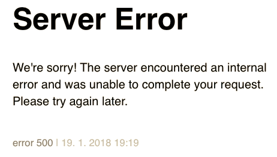
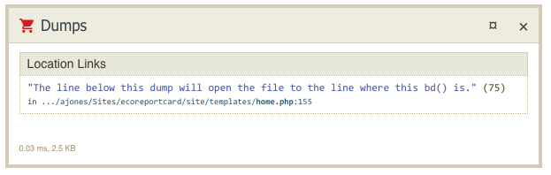
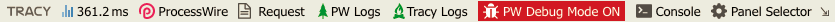
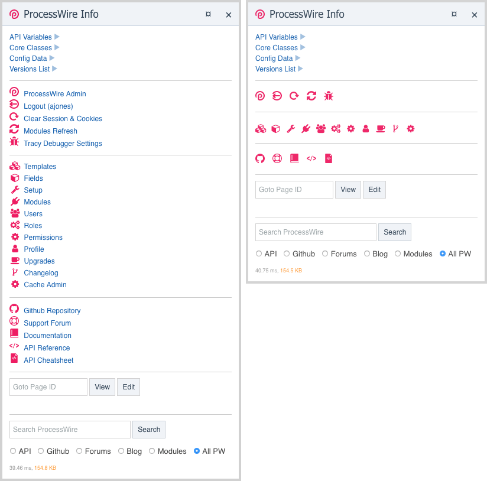

# Configuration

The sections below follow the order of fields in the module's configuration page (`Modules > Configure > TracyDebugger`).

## Main setup

##### Enable Tracy Debugger

> Uncheck to completely disable all Tracy Debugger features.

```
@options: enabled | disabled

@default: enabled
```
* You can also disable Tracy via the PW API with: `$config->tracyDisabled = true;`
* If disabled, a few tiny dummy classes will be loaded instead to ensure any debug calls, eg `bd()` etc don't cause errors.

##### Use Native PHP Session

> Check to use native PHP session instead of temporary files.

```
@options: enabled | disabled

@default: disabled
```

* Use this if you are having problems with Tracy's AJAX and Redirect bars not showing.
* IMPORTANT: Do not use this option together with the SessionHandlerDB module.

##### Output mode

> What mode Tracy is in for superusers and other authorized users.

```
@options: DETECT | DEVELOPMENT | PRODUCTION

@default: DETECT
```

* This setting only affects superusers and other users with the `tracy-debugger` permission.
* All other users and guests will always be forced into the safe PRODUCTION mode.

**DETECT**
* automatically switches to DEVELOPMENT or PRODUCTION if server is local or live (by IP address)

**DEVELOPMENT**
* **enables debug bar**
* shows the Tracy [BlueScreen](other-tools.md#bluescreen) for fatal errors

**PRODUCTION**
* **disables debug bar**
* all notices/warnings are hidden from view, but logged to file
* optionally send an email whenever an error is logged
* fatal errors are displayed like this:



***

## Access permission

##### Force superusers into DEVELOPMENT mode

> Check to force DEVELOPMENT mode for superusers even on live sites.

```
@options: enabled | disabled

@default: disabled
```

* By default, the Output Mode setting's DETECT option will force a site into PRODUCTION mode when it is live, which hides the DebugBar and sends errors and dumps to log files. However, with this checked, superusers will always be in DEVELOPMENT mode.

##### Force guest users into DEVELOPMENT mode on localhost

> Check to force DEVELOPMENT mode for guests (and other users without the `tracy-debugger` permission) when server detected as localhost.

```
@options: enabled | disabled

@default: disabled
```

* By default, guest users will always be in PRODUCTION mode (no debug bar). However, with this checked, they will always be in DEVELOPMENT mode on localhost.

##### Force isLocal check to always return true

> Force the isLocal check to always return true.

```
@options: enabled | disabled

@default: disabled
```

* WARNING: Only use this if you know what you are doing. When combined with "Force guest users into DEVELOPMENT mode on localhost", you can expose debug info to guest users on a live site.

##### Restrict non-superusers

> IP Address that non-superusers need to use TracyDebugger.

```
@param: IP address or a PCRE regular expression
```

* Enter IP address or a PCRE regular expression to match IP address of user, eg. /^123\.456\.789\./ would match all IP addresses that started with 123.456.789.

* Non-superusers are already blocked unless they have the "tracy-debugger" permission. But once a user has been given the permission, this option restricts access to the listed IP address. Highly recommended for debugging live sites that you have manually set into DEVELOPMENT mode.

##### Restrict superusers

> If checked, only superusers with the `tracy-debugger` permission will have access to Tracy.

```
@options: enabled | disabled

@default: disabled
```

***

## Miscellaneous

##### Strict mode

> Displays notices and warnings like errors.

* Check to enable strict mode which displays notices and warnings like errors - this results in the Tracy [BlueScreen](other-tools.md#bluescreen) which shows the full stack trace of the error. This setting can also be toggled on/off from the [Panel Selector](debug-bar.md#panel-selector) as needed.

##### Strict mode AJAX only

> Enables strict mode only for AJAX calls.

* Because Tracy intercepts notices and warnings, these will no longer be returned with the AJAX response which may result in a "success" response, rather than "failure". Notices and warnings from an AJAX call will be displayed in the AJAX bar's Errors panel, but you still might prefer this option as it provides a more prominent indication of failure.

##### Force scream

> Disables the @ (silence/shut-up) operator so those notices and warnings are no longer hidden.

* This is disabled when Strict Mode is enabled because of a [bug](https://forum.nette.org/en/25569-strict-and-scream-modes-together) in the core Tracy package.

##### Show location

> Shows the location of dump() and barDump() calls.



```
@options: LOCATION_SOURCE | LOCATION_LINK | LOCATION_CLASS

@default: all enabled
```

* LOCATION_SOURCE adds tooltip with path to the file, where the function was called.

* LOCATION_LINK adds a link to the file which can be opened directly.

* LOCATION_CLASS adds a tooltip to every dumped object containing path to the file, in which the object's class is defined.

##### Use debugInfo() magic method

> If a `__debugInfo()` method has been defined, it will be used instead of dumping the full object.

```
@options: enabled | disabled

@default: enabled
```

* Results in a smaller, cleaner dump, but you may miss some information.
* You can override this per call with the `debugInfo => true/false` option, eg. `bd($page, ['debugInfo' => false])`.
* Note that this also affects the output in the Request Info panel's Field List & Values section.

##### Keys to hide

> Keys to redact in dumps and bluescreens.

```
@default: dbPass, dbName, dbUser, user, username, pass, password, pwd, pw, auth, token, secret
```

* Enter keys separated by commas. Matching values will be replaced with `*****` when dumped or rendered in a bluescreen. Requires PHP 7.2+.

##### Maximum nesting depth

> Set the maximum nesting depth of dumped arrays and objects using `dump()` and `barDump()`.

```
@default: 3
```

* Warning: making this too large can slow your page load down or even crash your browser.
* Rather than adjusting this, consider using `barDumpBig()` or passing per-call options, eg. `bd($var, ['maxDepth' => 6, 'maxLength' => 1000])`.

##### Maximum string length

> Set the maximum displayed string length using `dump()` and `barDump()`.

```
@default: 150
```

* Rather than adjusting this, consider using `barDumpBig()` or passing per-call options.

##### Maximum number of items

> Set the maximum number of array/object items displayed.

```
@default: 100
```

##### Collapse top array/object

> Collapse arrays/objects in the top-level dump that have at least this many items.

```
@default: 14
```

##### Collapse array/object

> Collapse nested arrays/objects that have at least this many items.

```
@default: 7
```

##### Maximum number of AJAX rows in debug bar

> After this number of AJAX requests is shown in the debug bar, the oldest row is recycled.

```
@default: 3
```

* Note that you will need to do a hard browser reload for this setting to take effect.

##### Reserved memory size

> If you are getting memory exhaustion errors on Tracy's bluescreen, try increasing this value.

```
@default: 500000
```

##### Reference page being edited

> Reference page being edited, rather than the admin edit page process.

```
@options: enabled | disabled

@default: enabled
```

* When editing a page in the admin, the Request Info Panel will show details of the page being edited, and the Console Panel will assign the `$page` variable to the page being edited.

* Highly recommended unless you have a reason not to do this.

##### Open links in new tab

> Makes links open in a new browser tab.

```
@options: enabled | disabled

@default: disabled
```

* Used by links such as those in the Captain Hook and API Explorer panels.

***

## Error logging

##### Log severity

> Determines which PHP errors Tracy will log with detailed HTML reports.

```
@options: E_ERROR | E_WARNING | E_PARSE | E_NOTICE | E_CORE_ERROR | E_CORE_WARNING |
E_COMPILE_ERROR | E_COMPILE_WARNING | E_USER_ERROR | E_USER_WARNING | E_USER_NOTICE |
E_RECOVERABLE_ERROR | E_DEPRECATED | E_USER_DEPRECATED | E_ALL

@default: none
```

* These only affect log file content, not onscreen debug info.

##### Email errors "From"

> Send error emails from this address.

```
@param: email address
```

##### Email errors "To"

> Receive emails at this address when an error occurs in production mode.

```
@param: one address per line
```

* Leave blank to log to file (/site/assets/logs/tracy/) without being notified.

##### Clear "email sent" flag

> Check and save settings to remove the "email-sent" file so that you will start receiving new error emails.

```
@options: enabled | disabled

@default: disabled
```

* Once an email has been sent, further errors will not be emailed until you do this. This prevents flooding of your email inbox.

##### Slack Channel

> Post to this Slack channel when an error occurs.

```
@param: channel name (e.g. #errors)
```

##### Slack App OAuth Token

> Bot token for the Slack app that will deliver the error message.

```
@param: xoxb-... token
```

* Create a Slack app, add the `chat:write` scope, install it to your workspace, and paste the bot user OAuth token here. Tracy will post to the channel above when an error fires in PRODUCTION mode.

***

## Debug bar and panels

##### Show debug bar

> Whether the debug bar should be shown on the frontend, backend, or both.

```
@options: Frontend | Backend

@default: both
```

##### No debug bar in ...

> Debug bar is removed from certain modals and iframes by default for visual reasons, but enable them if you need to debug something specific.

```
@options: Regular modal | Inline modal | Overlay panels | Form Builder iframe

@default: Regular modal | Inline modal | Overlay panels
```

##### No debug bar in selected frontend templates

> Disable the debug bar on frontend pages with the selected templates.

##### No debug bar in selected backend templates

> Disable the debug bar when editing pages with the selected templates.

##### Hide debug bar by default

> Hide the debug bar by default on page load.

```
@options: enabled | disabled

@default: disabled
```

* This results in the bar being hidden (unless an error is reported), and replaced with a small "show bar" ⇱ icon.
* Alternatively, you can trigger a session-lasting hide at runtime without this setting, by clicking the ⇲ icon on the debug bar.

##### Show panel labels

> Adds labels to each panel icon in the debug bar.



```
@options: enabled | disabled

@default: disabled
```

* May take up too much horizontal space if you have lots of panels enabled, or on smaller screens.

##### Bar Position

> Position of the debug bar on the screen.

```
@options: Bottom Right | Bottom Left

@default: Bottom Right
```

* You will need to do a hard reload in your browser for changes to take effect.

##### Starting z-index for panels

```
@default: 100
```

* Adjust if you find panels are below/above elements that you don't want.

##### Frontend panels

* Determines which panels are shown in the Debug Bar on the frontend. Sort to match order of panels in Debugger Bar.

##### Backend panels

* Determines which panels are shown in the Debug Bar on the backend. Sort to match order of panels in Debugger Bar.

* Note that some panels are intentionally missing from this list because they have no use in the backend.

##### Disabled panels for restricted users

* Check the panels that should NOT be shown to users with the `tracy-restricted-panels` role or permission.

* Unchecked panels will still only be shown to restricted users if they are selected in the Front/Back-end options above.

***

## Panel Selector panel

##### Non-toggleable panels

> Selected panels will NOT be toggleable in the Panel Selector.

##### Add Disable/Enable (Toggler) Tracy button to Panel Selector

> Adds a button in the Panel Selector that lets you quickly disable or re-enable Tracy without leaving the page.

```
@options: enabled | disabled

@default: enabled
```

***

## Editor links

##### Editor protocol handler

```
@default: vscode://file/%file:%line
```

* All links from Tracy error messages and the custom ProcessWire Info Panel can be set up to open the file in your favorite code editor directly to the line of the error. By default the module is configured to work with VSCode, but it can be configured to work with pretty much any editor out there.

* Common protocol handlers:
    * VSCode: `vscode://file/%file:%line`
    * Sublime Text: `subl://open/?url=file://%file&line=%line`
    * PhpStorm: `phpstorm://open?file=%file&line=%line`

* In addition to configuring this module, you will most likely also need to register an appropriate protocol handler on your computer. Some helpers:
    * [VSCode handler](https://github.com/shengyou/vscode-handler)
    * [Sublime Text handler (macOS)](https://github.com/saetia/sublime-url-protocol-mac)
    * [PhpStorm handler](https://github.com/aik099/PhpStormProtocol)
* For other editors, Google "protocol handler editorname".

* The Tracy website also has [additional useful information](https://pla.nette.org/en/how-open-files-in-ide-from-debugger) about this.

##### Local root path

* Maps editor links from live site to local dev files. Only used if you are viewing a live site, otherwise it is ignored.

* An example path on MacOS might be: /Users/myname/Sites/sitefolder/

##### Use online editor for links

```
@options: Live | Local

@default: none
```

* This will open links in an online editor instead of your code editor.

##### Online editor

```
@options: Tracy File Editor | ProcessFileEdit

@default: Tracy File Editor
```

* Which online editor to use: Tracy File Editor or [ProcessFileEdit](http://modules.processwire.com/modules/process-file-edit/). ProcessFileEdit only appears if it is installed.

##### Force editor links to use Tracy File Editor

```
@options: enabled | disabled

@default: enabled
```

* Even if neither of the "Use Online Editor for Links" options are checked, if the File Editor Panel is enabled, all links will be sent to it.

* RECOMMENDED: This is a handy option if you generally want links to use your code editor, but want the option to use the File Editor occasionally. You can enable it (once or sticky) from the Panel selector on the debug bar without the need to change the above settings.

***

## Console panel

##### Snippets path

> This path will be checked for snippets.

```
@options: /site/templates/TracyDebugger/snippets/ | /site/assets/TracyDebugger/snippets/

@default: /site/templates/TracyDebugger/snippets/
```

* Neither of these directories exist by default so you will need to create them.

##### Maximum number of automatically named backups

> The maximum number of automatically named backups that will be retained before pruning the oldest.

```
@default: 25
```

##### Tabs Theme

> Color theme used for the Console panel's tabs.

```
@options: Dark | Light | Kiwi

@default: Dark
```

##### Code prefix

> Code block that will be added to each snippet stored on disk.

* Useful for `use` statements or helper functions you want available in every snippet. The prefix is prepended before the snippet runs.

***

## File Editor panel

These settings don't affect links opened via the Editor Protocol Handler. They only affect browsing directly from the File Editor folder/file selector sidebar.

##### Base directory

> The highest level directory that will be shown. You won't be able to access files above this.

```
@options: Root | Site | Templates

@default: Templates
```

* A more specific selection results in better performance in the File Editor Panel.

##### Allowed extensions

> Comma separated list of extensions that can be opened in the editor. Fewer extensions results in better performance in the File Editor panel.

```
@default: php, module, js, css, txt, log, htaccess
```

##### Excluded directories

> Comma separated list of directories that will be excluded from the file tree.

```
@default: site/assets
```

***

## Code editor settings

These settings apply to the Console panel and the File Editor panel.

##### Theme

> Color theme for the Ace code editor.

```
@default: tomorrow_night_bright
```

##### Font size / Line height

```
@default: 14 / 24
```

* Both are in pixels. If you change the font size, set the line height to a value roughly 8–10px higher than the font size for readable spacing.

##### Show Invisibles

> Show invisible characters like spaces, CR, and LF.

```
@options: True | False

@default: True
```

##### Tab size

```
@default: 4
```

##### Use Soft Tabs

> Use spaces instead of hard tab characters.

```
@options: True | False

@default: True
```

##### ProcessWire autocompletions

> Adds PW methods, properties, and page fields to the editor autocompletions.

```
@options: enabled | disabled

@default: enabled
```

* Adds approximately 200KB to the payload of the Console and File Editor panels.

##### Show description

> Shows the first line from the doc comment as a note connected to autocomplete matches.

```
@options: enabled | disabled

@default: enabled
```

* Unchecking this reduces the autocomplete payload to approximately 100KB.

##### Custom autocompletion snippets URL

> Link to a snippets file used for serving autocompletions in the Console and File Editor panels.

* Can be local or a remote URL such as a Github Gist. Tracy comes with two default autocompletions: `pwfind` and `pwforeach`. Type `pw` in the editor to see available options.
* If using a Github gist, you must use a CDN such as [cdn.statically.io/gist](https://cdn.statically.io/gist) or [gist.githubusercontent.com](https://gist.githubusercontent.com/).

***

## ProcessWire Info panel

##### Panel sections

> Which sections to include in the ProcessWire Info panel.

```
@options: Versions List | Admin Links | Documentation Links | Goto Page By ID |
ProcessWire Website Search

@default: all
```

##### Custom links

> Choose pages you would like links to. You can add links to any page in the admin.

```
@default: Setup | Templates | Fields | Modules | Users | Roles | Permissions | Profile
```

* Links are stored as paths (not IDs) so the setting is portable across sites when exporting/importing module config.

##### Show icon labels

> Shows labels next to each icon for the two "Links" sections.



```
@options: enabled | disabled

@default: enabled
```

* Nice for clarity, but takes up more space.

##### Open links in new tab

```
@options: enabled | disabled

@default: disabled
```

***

## Adminer panel

Settings under this section only appear when the [ProcessTracyAdminer](https://modules.processwire.com/modules/process-tracy-adminer/) module is installed.

##### Standalone mode

> Load Setup > Adminer in standalone mode (not embedded in the PW admin iframe).

```
@options: enabled | disabled

@default: disabled
```

##### Field edit links

> Add adminer links to each field in the page edit interface.

```
@options: enabled | disabled

@default: enabled
```

* Will only appear when the Adminer panel is enabled.

##### Theme color

```
@options: Blue | Green | Red

@default: Blue
```

##### JSON max level

> Max. nesting level for JSON preview in Adminer tables. 0 means no limit.

```
@default: 3
```

##### JSON In Table

> Apply JSON preview in the selection table view.

```
@options: enabled | disabled

@default: enabled
```

##### JSON In Edit

> Apply JSON preview in the edit form view.

```
@options: enabled | disabled

@default: enabled
```

##### JSON max text length

> Maximum length of string values in JSON preview. Longer texts will be truncated with ellipsis. 0 means no limit.

```
@default: 200
```

### AI SQL assistants

Optional AI-assisted SQL generation in Adminer's SQL command. Each provider activates only when its API key/URL is filled in.

> Beware: the database structure (CREATE TABLE statements, no row data) is sent to the configured provider with each request.

##### Gemini API key

> Google Gemini API key. Leave blank to disable.

* Get one at [aistudio.google.com/apikey](https://aistudio.google.com/apikey).

##### Gemini model

```
@default: gemini-2.5-flash
```

* See [Gemini API model list](https://ai.google.dev/gemini-api/docs/models).

##### Open WebUI API URL

> Base URL of an Open WebUI / OpenAI-compatible chat endpoint. Leave blank to disable.

```
@example: http://127.0.0.1:8080
```

##### Open WebUI model

```
@default: gpt-oss:120b
```

##### Open WebUI bearer token

> Optional bearer token. Leave blank if the endpoint is public.

***

## API Explorer panel

##### Show description

> Show the first line from the doc comment in its own column.

```
@options: enabled | disabled

@default: enabled
```

##### Toggle method doc comment

> Toggles the entire doc comment block when you click on the method column.

```
@options: enabled | disabled

@default: disabled
```

* Significantly increases the size of this panel.

##### Module classes

> Select module classes that you also want displayed.

```
@options: Core modules | Site modules

@default: none
```

* These options will significantly increase the size of this panel.

***

## Captain Hook panel

##### Show description

> Show the first line from the doc comment in its own column.

```
@options: enabled | disabled

@default: enabled
```

##### Toggle method doc comment

> Toggles the entire doc comment block when you click on the method column.

```
@options: enabled | disabled

@default: disabled
```

* Significantly increases the size of this panel.

***

## Request Info panel

##### Panel sections

> Which sections to include in the Request Info panel.

```
@options: Module Settings | Template Settings | Field Settings | Field Export Code |
Page Info | Redirect Info | Page Permissions | Language Info | Template Info | Page Meta |
Field List & Values | Server Request | Input GET | Input POST | Input COOKIE |
SESSION | Page Object | Template Object | Fields Object | Page/Template Edit Links
```

* Module Settings, Template Settings, and Field Settings will only appear if you are on the edit page for a module, template, or field.

* The three "Object" options will significantly increase the size of this panel and are excluded by default.

##### Show image thumbnails in Field List & Values section

> Load all image thumbnails for the page, along with the dimensions & size details.

```
@options: enabled | disabled

@default: disabled
```

* Can significantly increase the size of this panel and rendering time if the page has lots of images.

***

## Debug Mode panel

##### Panel sections

> Which sections to include in the Debug Mode panel.

```
@options: Pages Loaded | Modules Loaded | Hooks Triggered | Database Queries |
Selector Queries | Timers | User | Cache | Autoload

@default: all
```

##### Show debug mode tools even if `$config->debug = false;`

> If checked, the debug tools will be displayed regardless of whether debug mode is enabled.

```
@options: enabled | disabled

@default: enabled
```

***

## Diagnostics panel

##### Panel sections

> Which sections to include in the Diagnostics panel.

```
@options: Filesystem Folders | Filesystem Files | MySQL Info

@default: Filesystem Folders
```

* The "Filesystem Files" option may significantly increase the generation time for this panel.

***

## Dumps panel

##### Dump Tabs

> Select and order the tabs available when dumping ProcessWire objects via `dump()` / `barDump()`.

```
@options: Debug Info | Full Object

@default: Debug Info | Full Object
```

* The first item will be the tab that opens by default.

***

## TODO panel

##### Ignore directories

> Comma separated list of terms used to match folders to be ignored when scanning for ToDo items.

```
@default: git, svn, images, img, errors, sass-cache, node_modules
```

##### Allowed extensions

> Comma separated list of file extensions to be scanned for ToDo items.

```
@default: php, module, inc, txt, latte, html, htm, md, css, scss, less, js
```

##### Scan site assets

> Check to allow the ToDo panel to scan the /site/assets directory.

```
@options: enabled | disabled

@default: disabled
```

* If you check this, you should add files, logs, cache, sessions and other relevant terms to the `Ignore Directories` field.

##### Scan site modules

> Check to allow the ToDo to scan the /site/modules directory. Otherwise it will only scan /site/templates.

```
@options: enabled | disabled

@default: disabled
```

* Not recommended unless you are a regular module developer.

##### Specified directories

> Line break separated additional directories to be scanned for ToDo items.

```
@example: site/classes
site/modules/MyModuleName
```

***

## Log and Exceptions panels

##### Excluded PW log files

> Select ProcessWire log files to be excluded from the ProcessWire Logs panel.

* Useful if you have logs that are written to regularly on user interaction that are overwhelming more useful alert/warning/error logs.

##### Excluded Tracy log files

> Select Tracy log files to be excluded from the Tracy Logs panel.

##### Number of log entries

> Set the number of log entries to be displayed for the Tracy and ProcessWire log viewer panels.

```
@options: integer
@default: 100
```

##### Number of exceptions

> Set the number of exceptions to be displayed for the Tracy Exceptions panel.

```
@options: integer
@default: 25
```

***

## Template Resources panel

##### Show content of ProcessWire objects

> Shows the full ProcessWire object contents, rather than arrays of values.

```
@options: enabled | disabled

@default: disabled
```

* Only recommended for specific debugging purposes.
* Checking this will significantly increase the size of this panel if you have any variables set to ProcessWire objects.

***

## Links panel

##### Links code

> One link per line. Optionally add a label for each link.

```
@example: https://www.google.com | Google Search
```

* You can also add links from the Links panel itself by entering a URL — they will be appended here automatically.

***

## Custom PHP panel

##### Custom PHP code

> Use this PHP code block to return any output you want.

* This example shows how to output a link to Google PageSpeed:

```
@example return '<a href="https://developers.google.com/speed/pagespeed/insights/?url='.$page->httpUrl.'">Google PageSpeed</a>';
```

***

## User Switcher panel

These options can be useful if you use the User system to store frontend "members" and the system has a lot of users. Use no more than one of the next three options for limiting the list of users.

##### Selector

> Selector used to determine which users will be available.

```
@example: roles=editor, created>=-30days
```

##### Excluded Roles

> Users with selected roles will not be available from the list of users to switch to.

##### Included Roles

> Only users with these selected roles will be available. If none selected, then all will be available (unless Excluded Roles is populated).

##### User label field

> Determines which user field(s) will be used to identify users in the selection interface.

```
@default: {name} ({email})
```

***

## Request Logger panel

##### Request methods

> Which request methods to log.

```
@options: GET | POST | PUT | DELETE | PATCH

@default: GET | POST | PUT | DELETE | PATCH
```

* It may be useful to disable GET so that normal page visits are ignored.

##### Maximum number of logged requests

> Number of requests to be kept for each page.

```
@default: 10
```

##### Output type

> Whether logged data returned by `getRequestData()` is an object or an array.

```
@options: Array | Object

@default: Array
```

***

## Server type indicator

##### Where

> Add indicator based on server IP address and/or subdomain.

```
@options: Backend | Frontend

@default: none
```

* This is a colored visual indicator, either in the debug bar or controlled by custom CSS as a full height or width bar.

##### Indicator colors

> Determines what colors are used for which server types (local, *.test, *.dev, dev.*, etc).

```
@default:
local|#FF9933
*.local|#FF9933
dev.*|#FF9933
*.test|#FF9933
staging.*|#8b0066
*.com|#009900
```

* Use "type|#color" entries to define indicator styling for each server type. "local" is determined by IP address. Other types are detected based on their existence in subdomain or TLD (eg. dev.mysite.com or mysite.dev), depending on whether you include the period after (dev.﹡) or before (﹡.dev).

##### Indicator type

> Choose how the indicator is displayed.

```
@options: Indicator on debug bar | Custom - control with CSS | Add prefix page title | Favicon badge

@default: Favicon badge
```

* The example image below shows the indicator on the debug bar on a site with a .test TLD.


##### Custom indicator CSS

> Use `[color]` and `[type]` shortcodes to add an indicator based on server type. Only used when "Custom - control with CSS" is selected above.

```
@default:
body::before {
    content: "[type]";
    background: [color];
    position: fixed;
    left: 0;
    bottom: 100%;
    color: #ffffff;
    width: 100vh;
    padding: 0;
    text-align: center;
    font-family: sans-serif;
    font-weight: 600;
    text-transform: uppercase;
    transform: rotate(90deg);
    transform-origin: bottom left;
    z-index: 999999;
    font-size: 11px;
    height: 13px;
    line-height: 13px;
    pointer-events: none;
}
```

***

## User dev template

##### Enable user dev template

> If a user has a permission named to match the page template with the set suffix, the page will be rendered with that template file rather than the default.

```
@options: enabled | disabled

@default: disabled
```

##### User dev template suffix

> Template file suffix. eg `dev` will render the homepage with the `home-dev.php` template file if the user has a matching permission (prefixed with `tracy`), eg. `tracy-home-dev`.

```
@example: dev
```

* You can also use `tracy-all-dev` to enable the dev template for all templates that have a matching `*-dev.php` file.

***

## User Bar

##### Show user bar

> This bar is shown to logged in users without permission for the Tracy debug bar (typically all non-superusers).


```
@options: enabled | disabled

@default: disabled
```

##### Show user bar for Tracy users

> Also show the bar to users with Tracy debug bar permission.

```
@options: enabled | disabled

@default: disabled
```

* Only recommended if you position this bar somewhere other than bottom right so it doesn't conflict with the Debug bar.

##### Features

> Determines which features are shown on the User Bar.

```
@options: Admin | Edit Page | Page Versions
@default: Admin | Edit Page
```


* The Page Versions function requires that the user has the "tracy-page-versions" permission.
* Page versions allows an authorized user to select alternate versions of a page (different template files). [More Details](other-tools.md#user-bar).

##### Custom features

> Use this PHP code block to return any output you want.

```
@example return '<a href="https://developers.google.com/speed/pagespeed/insights/?url='.$page->httpUrl.'" target="_blank"><svg xmlns="http://www.w3.org/2000/svg" xmlns:xlink="http://www.w3.org/1999/xlink" version="1.1" x="0px" y="0px" viewBox="0 0 452.555 452.555" style="enable-background:new 0 0 452.555 452.555;" xml:space="preserve" width="16px" height="16px"><path d="M404.927,209.431h47.175c-3.581-49.699-23.038-94.933-53.539-130.611l-33.715,33.715l-23.275-23.296l33.758-33.78 C339.826,24.353,294.527,4.206,244.591,0.194v48.923h-32.917V0C161.22,3.236,115.296,22.8,79.165,53.668l35.57,35.549 l-23.296,23.296L55.804,76.878C24.332,112.858,4.12,158.804,0.475,209.452h50.864v32.917H0.453 C8.93,359.801,106.646,452.555,226.256,452.555s217.347-92.754,225.846-210.186h-47.197L404.927,209.431L404.927,209.431z M228.133,362.217c-24.116,0-43.659-19.522-43.659-43.681c0-17.839,10.742-33.176,26.144-39.928l16.394-151.707l4.034,0.043 l14.927,151.729c15.229,6.881,25.863,22.045,25.863,39.863C271.857,342.695,252.27,362.217,228.133,362.217z" fill="'.$iconColor.'"/></svg></a>';
```


##### Top / Bottom

```
@options: Top | Bottom
@default: Bottom
```

##### Left / Right

```
@options: Left | Right
@default: Left
```

##### Background color

> Leave blank for transparent/none.

```
@example: #FFFFFF
```

##### Background opacity

```
@options: 0 - 1

@default: 1
```

##### Icon color

```
@default: #666666
```

***

## Method shortcuts

##### Enable shortcut methods

> Uncheck to not define any of the shortcut methods. If you are not going to use these in your templates, unchecking means that they will not be defined which may reduce possible future name clashes. If in doubt, uncheck and use the full methods (`TD::dump()`, `TD::barDump()`, etc).

```
@options: enabled | disabled
@default: enabled
```

* If this, or one of the shortcut methods is not enabled, but is called in your templates, all users will get a "call to undefined function" fatal error, so please be aware when using the shortcut methods in your templates if they are not enabled here.

##### Enabled shortcuts

> Uncheck any shortcuts/aliases to methods that you do not want available.

```
@options:
addBreakpoint() for TD::addBreakpoint()
bp() for TD::addBreakpoint()
barDump() for TD::barDump()
bd() for TD::barDump()
barEcho() for TD::barEcho()
be() for TD::barEcho()
barDumpBig() for TD::barDumpBig()
bdb() for TD::barDumpBig()
debugAll() for TD::debugAll()
da() for TD::debugAll()
dump() for TD::dump()
d() for TD::dump()
dumpBig() for TD::dumpBig()
db() for TD::dumpBig()
l() for TD::log()
templateVars() for TD::templateVars()
tv() for TD::templateVars()
timer() for TD::timer()
t() for TD::timer()
```

* Useful if any of these functions/methods are defined elsewhere in your site and you are getting a "previously declared" fatal error.
