# Debug Bar
The debug bar shows non-fatal errors, dumps, and provides access to all the custom panels/tools for ProcessWire development. You can set the default panels for both frontend and backend versions of the bar and also add / remove them on-the-fly via the [Panel Selector](#panel-selector).


##  Adminer
Adminer is a MySQL database management tool similar to PHPMyAdmin.

You can access it via a panel from the debug bar, or from your PW admin Setup menu.

You will be automatically connected to the database table for the current ProcessWire installation using the credentials in your /site/config.php file.

There are several direct links from within Tracy to open Adminer to specific tables / rows. Look for these links in the Request Info panel in the following sections:

* Page Info
* Module Settings
* Template Settings
* Template Info
* Field Settings

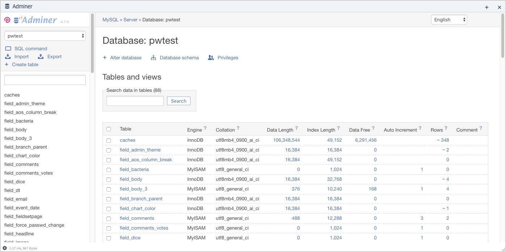

***

##  API Explorer
Generates a searchable list of all methods and properties in your ProcessWire install.

Results are cached for speed, but will be updated whenever you update your ProcessWire version or install a new module.

* Class::method (first column) links to ProcessWire API docs, either on processwire.com or locally if you have the API Explorer module installed
* Line number (second column) links to the method in your code editor, or via the File Editor Panel or the ProcessFileEdit module
* Method / property summary (third column) which can optionally toggle the full docblock

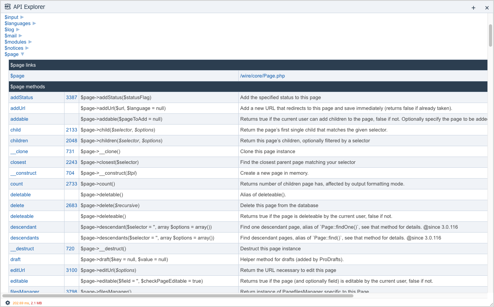

***

##  Captain Hook
Generates a list of hookable methods in your ProcessWire install, including site modules.

Results are cached for speed, but will be updated whenever you update your ProcessWire version or install a new module.

* Class::method (first column) links to ProcessWire API docs, either on processwire.com or locally if you have the API Explorer module installed
* Line number (second column) links to the method in your code editor, or via the File Editor Panel or the ProcessFileEdit module
* Method summary (third column) which can optionally toggle the full docblock

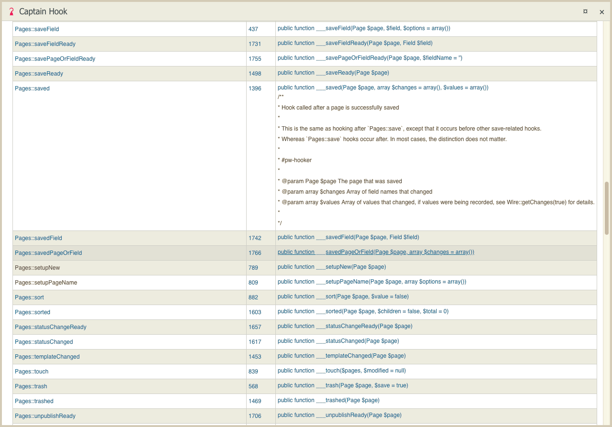

***

##  Console

* Code highlighting and syntax checking
* Access to all PW variables: $pages, $page, $user, $input, $fields, $templates, $modules, etc
* Access to $field, $template, $module when viewing the settings for a field, template, or module in the ProcessWire admin
* Access to all template defined variables and functions
* Works with `bd()`, `d()`, `fl()`, and `l()` calls, and `echo`. `d()` is recommended in most scenarios because output will appear in the results panel below the code
* Also works with `bdb()`, `bdl()`, and `db()` big/live variants
* Supports PHP, HTML, or mixed HTML/PHP syntax
* All output is generated via ajax, and so no page load required
* Only available to superusers
* Caches code so it stored between page reloads, navigation to other pages, and even browser restarts
* Use CTRL + Enter or CMD + Enter or the "Run Code" button to run the code
* In-code search & replace with CMD/CTRL + F
* History stack
	* ALT + PageUp | back
	* ALT + PageDown | forward
* Fullscreen editing mode with quick toggles between: all code, all results, and mixes of both.
	* CTRL + SHFT + Enter | toggle fullscreen mode
	* CTRL + SHFT + ↑ | collapse code pane
	* CTRL + SHFT + ↓ | collapse results pane
	* CTRL + SHFT + ← | restore split to last saved position
	* CTRL + SHFT + → | split to show all the lines of code
	* CTRL + SHFT + PageUp	| one less row in code pane (saves position)
	* CTRL + SHFT + PageDown | one more row in code pane (saves position)
	* SHFT + Enter | Expand to fit all code and add new line (saves position)
	* SHFT + Backspace | Contract to fit all code and remove line (saves position)
* Snippets storage for regularly used code
* Options to run code instead at `init`, `ready`, or `finished` - useful for testing hooks. To use this, click Run, select `init`, `ready`, or `finished` and then execute whatever action in ProcessWire that is needed to trigger the hook. An orange icon will indicate this feature is active. You can switch to `off` manually when you are done. It will also expire automatically after 5 minutes.


Remember that this allows you to run any PHP code, so be careful!

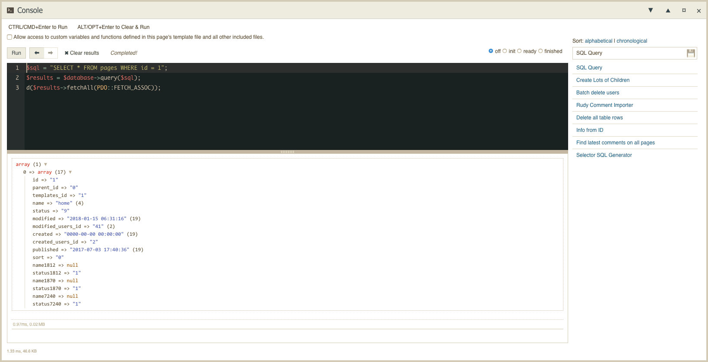

***

##  Custom PHP
This panel lets you output anything you want. Primarily I see this being used for creating links to things like Google PageSpeed, but use your imagination.

```php
return '<a href="https://developers.google.com/speed/pagespeed/insights/?url='.$page->httpUrl.'">Google PageSpeed</a>';
```

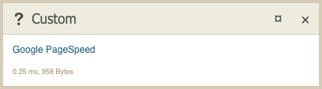

***

##  Debug Mode
Provides access to most of the information that is available in the back-end "Debug Mode Tools" section of your PW admin. This panel makes it available on the front-end and even when Debug Mode is off. Note that with Debug Mode Off, you won't have access to the "Database Queries", "Timers", and "Autload" sections. This is a ProcessWire core restriction.

Other information from the back-end "Debug Mode Tools" (POST, GET, REQUEST, COOKIE, SESSION) have been moved to the [Request Info Panel](#request-info).

The icon color on the debug bar is red when debug mode is on and green when it is off. This may seem opposite, but the idea is that when the icon is green, it is OK for production mode, whereas red indicates something that you need to be alerted to. This is particularly useful if you have the "Superuser Force Development Mode" option enabled because you will see the debug bar even in Production mode.

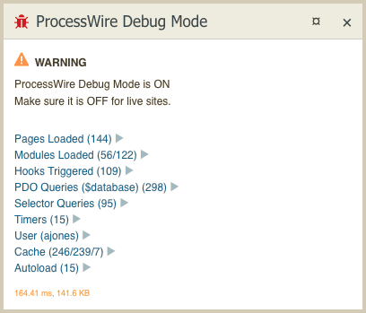

***

##  Diagnostics
### Filesystem Folders
Overview of the filesystem access permissions for all the key folders and files in your PW install. It also provides status and notes about these. These should not be taken as definitive (especially if you are on a Windows system), but rather as a guide and reminder to check these. The debug bar icon for this panel is colored to match the most serious status level - OK, Warning, or Failure.

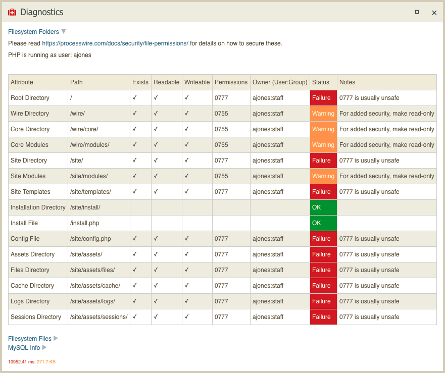

### Filesystem Files
Generally not recommended to enable this (in the module config settings), because it is very slow to generate, but if needed, it shows the permissions for all files within the site.

### MySQL Info
Some basic details about your MySQL server and client setup.

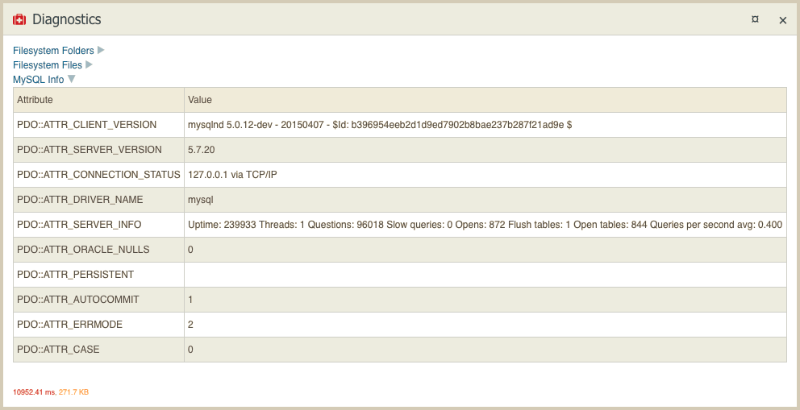

***

##  Dumps
This panel is only displayed when you have called the barDump() method and contains the contents of that dump.

Note the second optional parameter used to name the outputs in the Dumps panel.

```php
bd($page->body, 'Body');
bd(array('a' => array(1,2,3), 'b' => array(4,5,6)), 'Test Array');
```

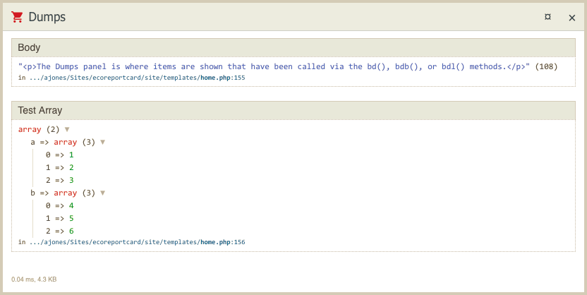

> For more details, see the [barDump()](debug-methods.md#bardump) and other associate debug methods

***

##  Dumps Recorder
If this panel is enabled, any calls to bd() will be sent to this panel instead of the main dumps panel. This is useful in several situations where you want to compare dumps from various page requests. Dumps will be preserved until the session is closed, or until you click the "Clear Dumps" button. It can also be useful in some situations where dumps are not being captured with the regular dumps panel which can sometimes happen with modules, complex redirects, or other scenarios that are hard to pin down.

***

##  Errors
The errors panel is only displayed when there are non-fatal errors and you are not in Strict Mode. All PHP notices and warnings will be displayed in this panel.

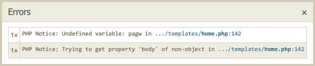

***

##  Event Interceptor

> This panel lets you define any Hook that you want to intercept.

```
@Hook
@options: Before | After
@default: Before

@Return
@options: Default | False
@default: Default
```

Returns the contents of $event->object and $event->arguments in the panel.

**CAUTION  with Return False**

`Return: False` prevents the chosen hook from being executed.
For example, setting the hook to `Pages::save` and then deleting a page can result in some pages ending up having the trashed status, but their parent still listed as the home page. This is a situation that requires some careful database manipulation to fix.

* **Green:** no hook set
* **Orange:** hook set, but nothing intercepted
* **Red:** hook set and event intercepted

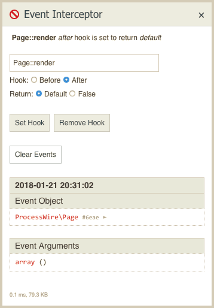

***

##  File Editor

* Supports editing all files in your PW install (you can define the root as /, /site, or /site/templates
* Can be used as the handler for opening editor links from the debug bar (errors, log files, Captain Hook, ToDo, Template editor, etc), rather than your code editor
* Can be enabled as the link handler for live sites only, or local as well if you prefer
* Has "Test" functionality for all files so if you make a change, it will only appear for you and not other users
* Red icon: Test code is being rendered
* Makes a backup of the old version each time you save a change and provides a "Restore Backup" button to instantly revert
* Supports in-code search & replace with CMD + F
* Syntax highlighting/linting for PHP, CSS, and JS
* This replaces the Template Editor panel, so that one has been removed
* Handles fatal errors gracefully - this is the biggest feature in my opinion. The problem with most online file editors is that if you accidentally make a code change that results in a fatal error, it can be impossible to fix and resave because the system is not functional. This editor gets around this problem by using Tracy's custom error handling which allows debug bar panels to continue to work, so you can manually fix the problem, or click the "Restore Backup" button. Of course if you used the "Test" option, you don't even need to worry, because you are the only one to see the version with the error anyway.

**Action buttons (some only available when relevant):**
* **Test**: reloads the page using the code in the editor - no changes are made to the template file or the code served to all other users of the site.
* **Save**: saves the editor code to the template file, making this a live and permanent change.
* **Reset**: re-loads the page (and the code in the editor) with the code from the saved file. This is no different from loading the page again, but different from clicking the "reload" button in your browser which will actually send the test code again.
* **Restore**: returns the code for the file to the last saved version (restored from automatic backup of the file)

**Possible use scenarios**
* Use this panel similarly to your dev console for tweaking CSS/HTML - it still requires a page reload, but there are likely less clicks than your normal workflow.
* Tweak a live site if you're away from your computer and need a quick way to fix something, but want the ability to test first without breaking something temporarily due to a simple syntax error mistake or more serious code mistakes.
* Add debug statements: `bd()`, `d()`, `fl()` etc to your file code without editing touching the actual files.

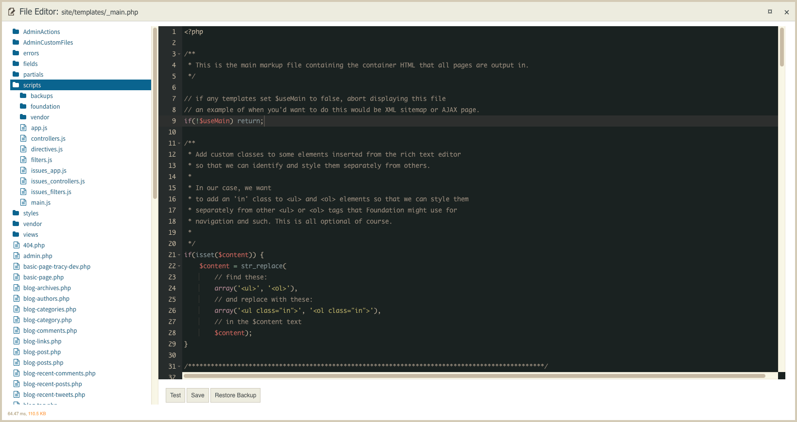

***

##  Git Info

Displays the Git branch, latest commit message, etc for your site (assuming you have it under Git version control).

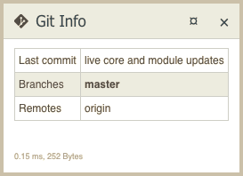

***

##  Mail Interceptor
Intercepts all outgoing emails sent using `wireMail()` and displays them in the panel. Ideal for form submission testing. This panel is activated when enabled, so it's best to enable it from the Panel Selector using the sticky option when needed. If you'd also like to receive the email at a test address (but not the original recipients), you can enter an address and click "Set Email".

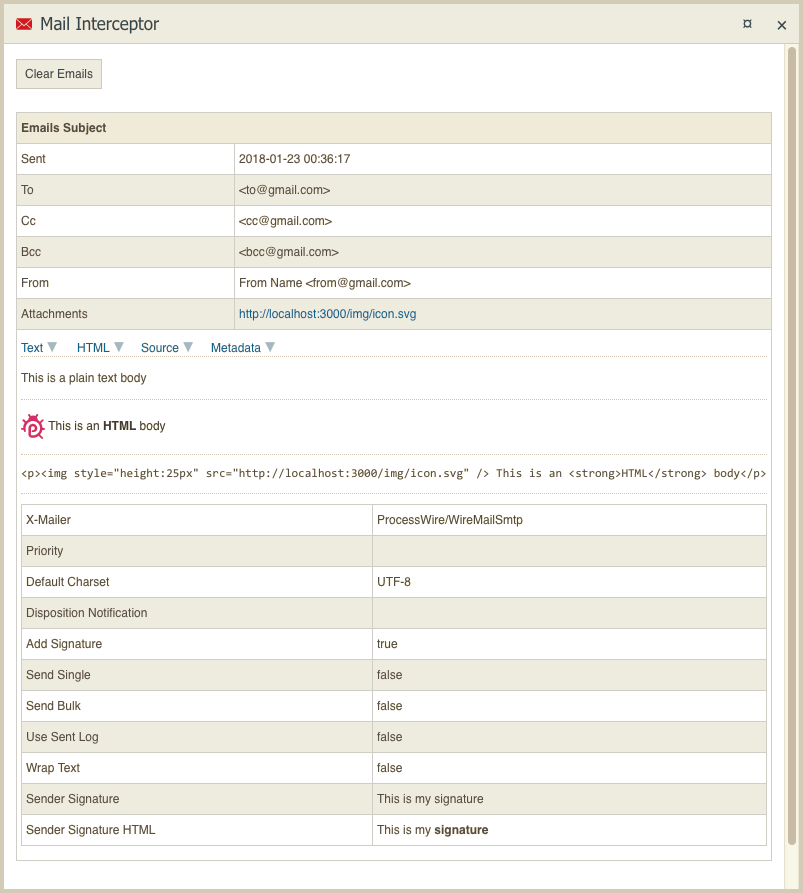

***

##  Methods Info
Lists available logging methods you can call in your PHP code.<br />Links to Tracy Debugger docs (this site) and [Tracy Nette docs](https://tracy.nette.org/)

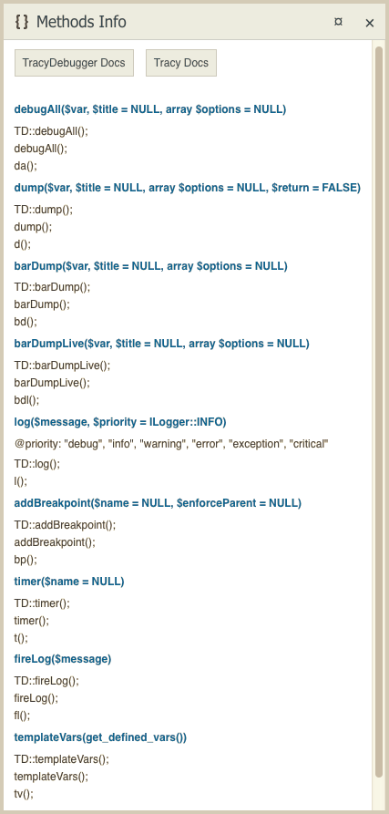

***

##  Module Disabler
This panel makes use of the ProcessWire core "disabled" flag for disabling autoload modules for testing / debugging purposes. It can potentially result in a fatal error on your site (this is a ProcessWire core issue, rather than specific to this panel). Because of this, it is only available when ProcessWire's advanced and debug modes are enabled.

If you do end up with a fatal error after disabling a module, this panel provides a script for automatically restoring the modules database table. Whenever you disable any modules, a backup of the "modules" database table is automatically saved.

To restore you have two choices:

Copy "/site/assets/cache/TracyDebugger/restoremodules.php" to the root of your site and load it in your browser

OR

Execute "/site/assets/cache/TracyDebugger/modulesBackup.sql" manually (via PHPMyAdmin, the command line, etc)

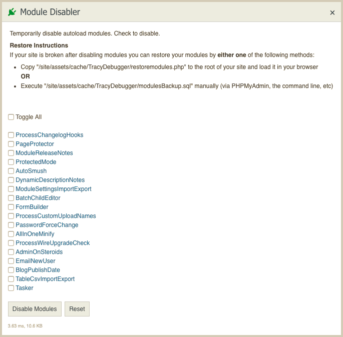

***

##  Output Mode
Indicates which mode Tracy is in - DEVELOPMENT or PRODUCTION - this is determined at runtime so if you have configured it to "Detect" mode, you can easily see which mode it has automatically switched to. This is useful if you have the "Superuser Force Development Mode" option enabled because you will see the debug bar even in Production mode.

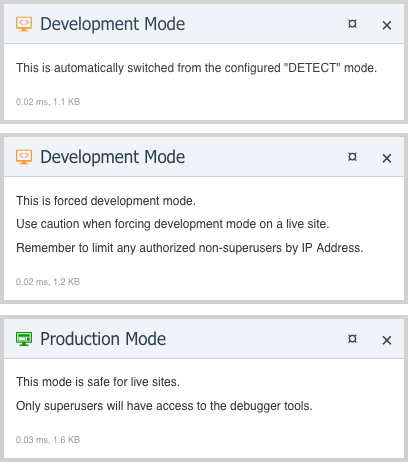

* Note that no matter what mode you are in, guest users will always be in PRODUCTION mode which means no debug bar and no detailed error reporting.

***


##  Page Recorder
This panel records the ID of all pages added whenever it is enabled (so this is one you'll want off by default and just enabled via "Sticky" when you need it).

This is perfect for all sorts of testing, whether you need to create a LOT of pages for performance testing or you are testing a form which is automatically creating pages. Once you are done with the testing session, simply click the "Trash Recorded Pages" button and they will all be moved to the Trash.

If you decide you want to keep the pages, you can click "Clear Recorded Pages List" instead.

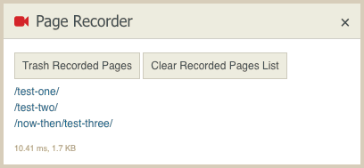

***

##  Panel Selector
Allows you to set up a default set of panels in the module config settings and then easily enable / disable other panels from the debugger bar.

Your page loading speed will be better if you limit the default panels to those you use all the time and load others as needed via this selector.

There are three options: Once, Sticky, and Reset
* **Once** will only make the selection change for one page load
* **Sticky** will keep the changes for the browser session
* **Reset**  will return to the default set defined in the module config settings

There are indicators if:

**\*** the panel is set in the default list in the module config settings

 the state of the panel is different for the current view, ie you have made a "Once" change

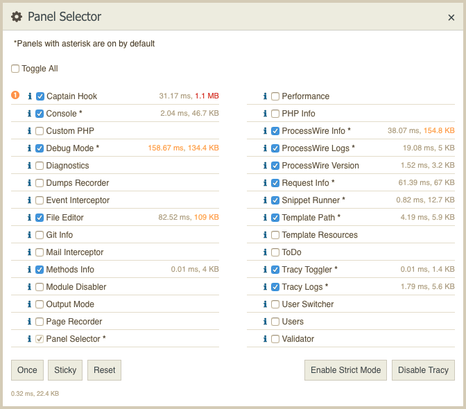

***

##  Performance
Performance Panel is a third party extension for Tracy developed by Martin Jirásek. It adds support for inserting named breakpoints in your code and reports execution time and various memory usages stats between the various breakpoints. This is where calls to addBreakpoint() are rendered.

```
bp('A');
for($i = 0; $i < 10000000; $i++) {
     $a += $i;
}
bp('B');
sleep(2);
bp('C', 'B');
for($i = 0; $i < 10000000; $i++) {
     $a += $i;
}
bp('D');
```

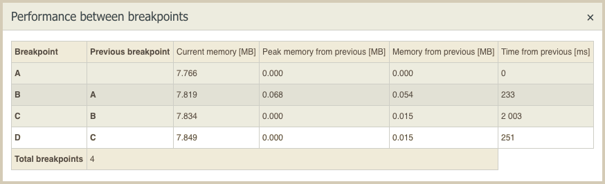

***

##  PHP Info
Provides all the output from PHP's `phpinfo()`. Probable best to leave disabled unless you need to check something.

CTRL/CMD + F works well to find relevant entries within this panel (and all panels actually), although this seems to be browser specific. It works in Chrome and Safari, but not Firefox.

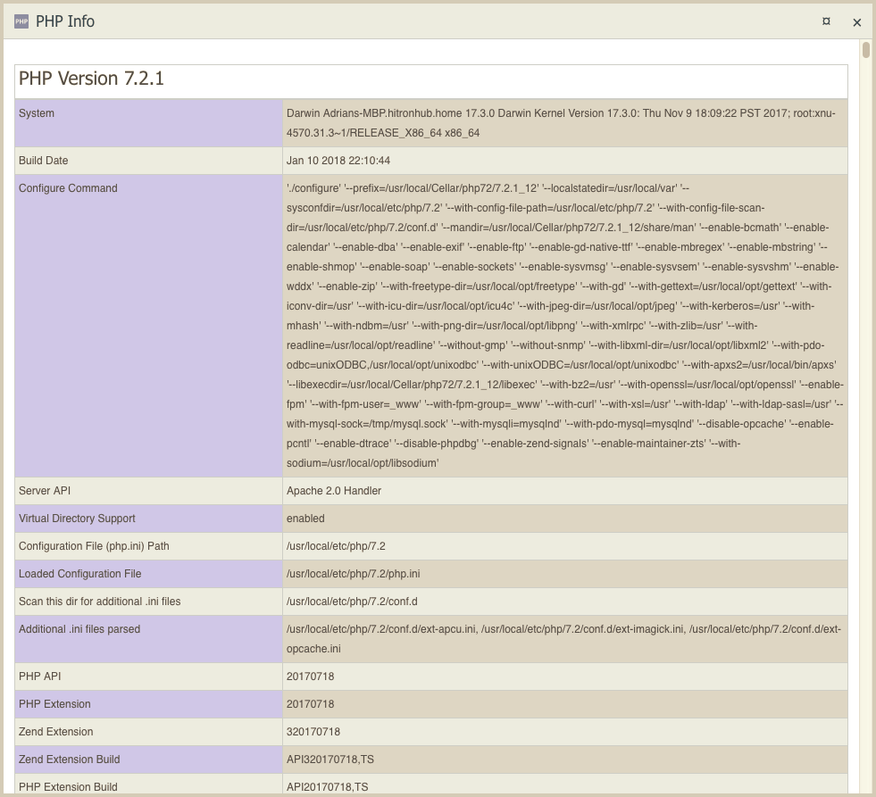

***

##  Processwire Info
Provides a wide variety of links, information and search features for all things ProcessWire.

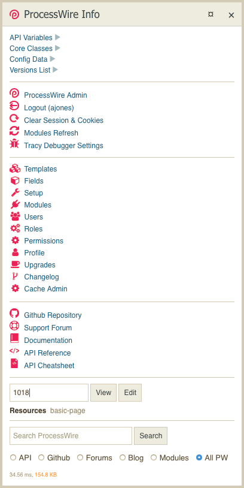

***

##  ProcessWire Logs
Displays the most recent entries across all ProcessWire log files with links to view the log in the PW logs viewer, as well as direct links to view each entry in your code editor. By default it shows the last 10, but this can be changed in the config settings. A red icon indicates the last page load contained an errors or exceptions log entry. An orange icon is for all other log types.

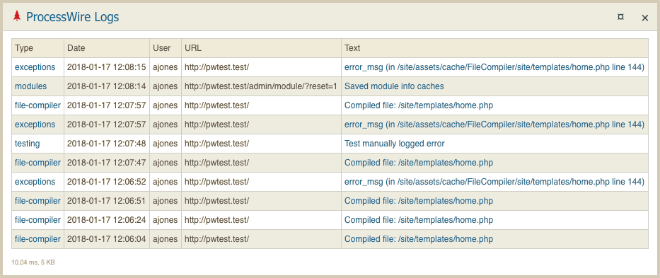

***

##  ProcessWire Version
Lets you instantly switch your PW version. This is probably most useful for module developers, but can also be helpful for other users to help debug PW core or module problems. It's probably obvious, but the switcher is not recommended for live sites, so don't blame me if a version change breaks your site (especially between the 2.x and 3.x branch)!

The available versions come from Ryan's ProcessWire Upgrades module - so any version that you installed via it will be available.

When you click "Change", it swaps the names of: wire/, .htaccess, and index.php - much easier than manually renaming.

The icon is green when you are using the latest version that is available on your system, and orange for any other version.

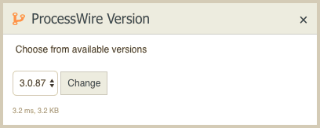

***

##  Request Info

Provides very detailed infomation and links related to the current page. It contains several expandable sections listed below.

### Page Info
Links to view (from page name) and edit the page (from page ID), template, parent and sibling pages, etc. Also includes page status, creation, modified, and published username and datetime.

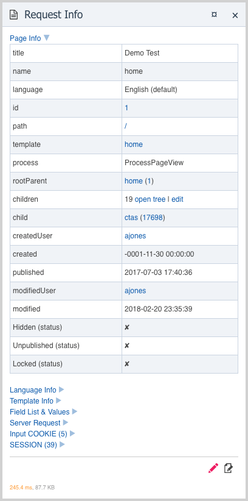

### Language Info
Details about the languages of the current page (title, name, and status). Also includes a link to edit each language.

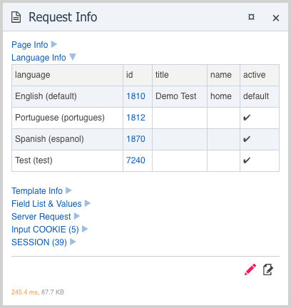

### Template Info
Details about the template of the current page and its settings, includes a link to open the template for editing in the PW admin, and the template file for editing in your code editor.

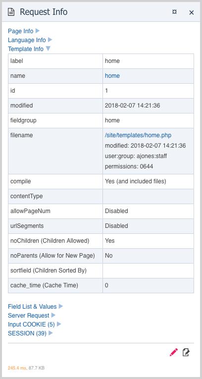

### Fields List & Values
Complete list of all available fields for the page and their values - all arrays/objects are presented as expandable trees. For image fields it provides additional information, such as filesize and dimension attributes. There is also Settings column for each field - truncated in this screenshot so that everything else is legible.

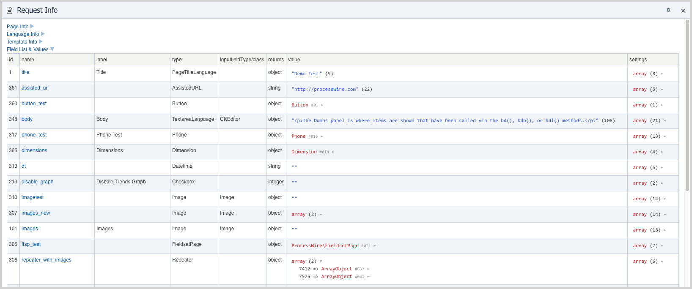

### Server Request

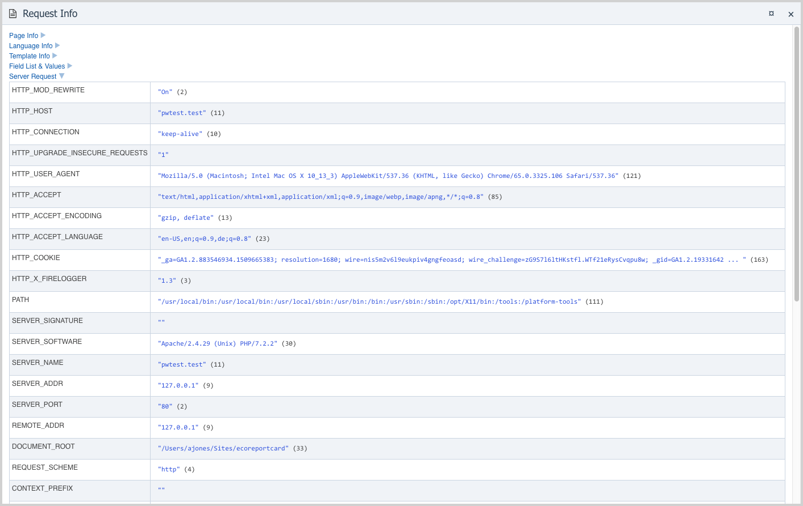

### Input GET

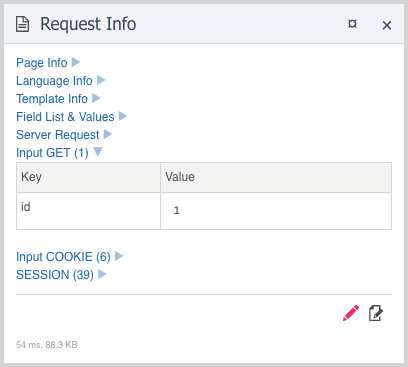

### Input POST

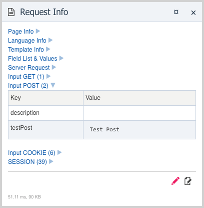

### Input COOKIE

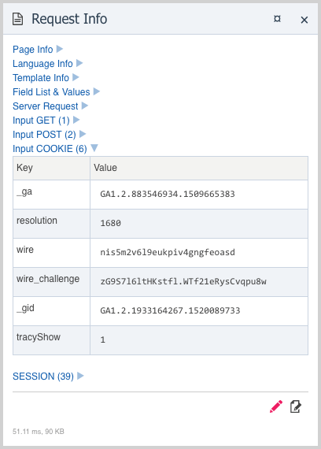

### SESSION

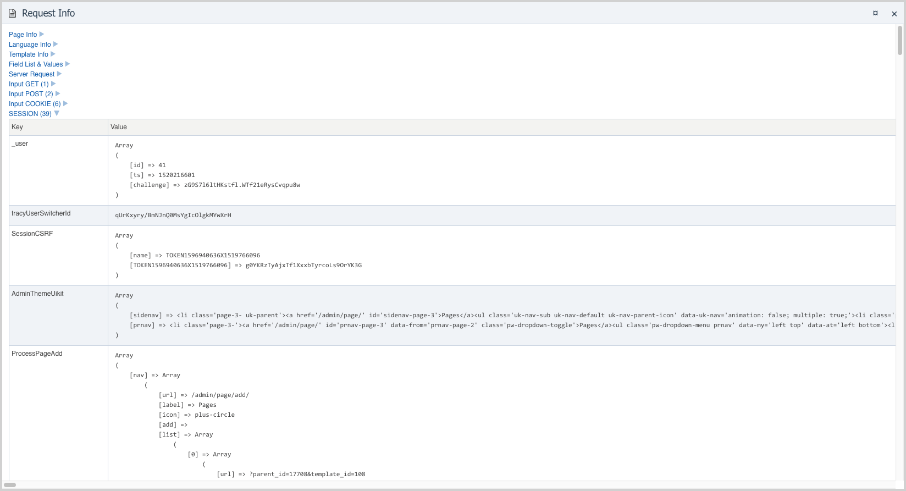

### Template Settings

This section is only available when viewing the settings page for a template in the admin

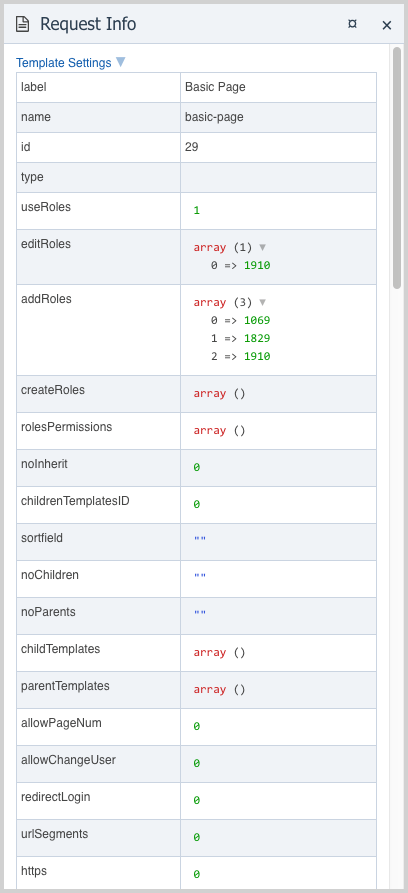

### Field Settings

This section is only available when viewing the settings page for a field in the admin

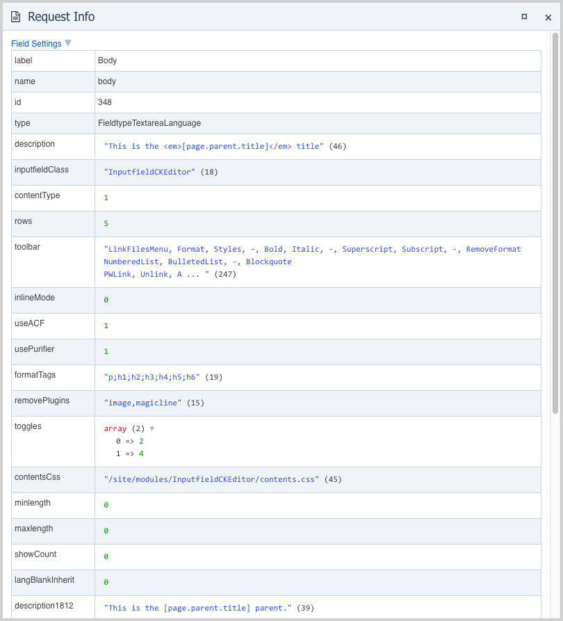

### Module Settings

This section is only available when viewing the settings page for a module in the admin

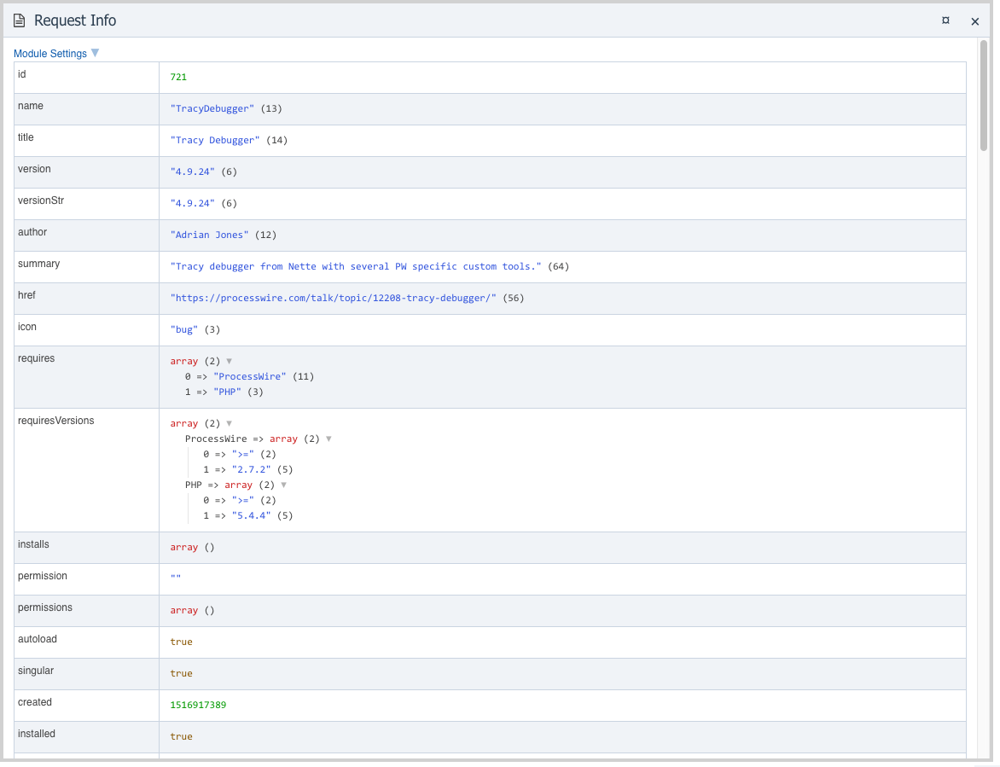


***

##  Snippet Runner
This is similar to the [Console Panel](#console), but instead lets you run snippets stored on the server's filesystem which allows for easier version control, and also for editing snippets in your code editor. It has access to all the same ProcessWire system variables that the Console panel has, so please see it's documentation for details.

Snippets can be stored in either of these. Visit the config settings to set which you prefer. You can also make use of subfolders to categorize your snippets.
* /site/templates/TracyDebugger/snippets/
* /site/assets/TracyDebugger/snippets/

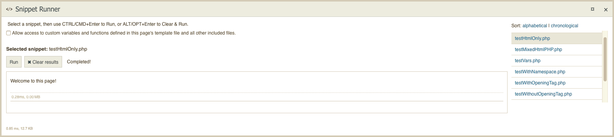

***

##  System Info
Provides a table of basic stats about the current page and your system.

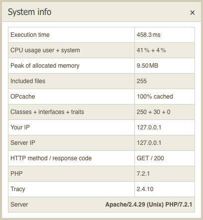

***

##  Template Path
The template path panel allows you to temporarily choose an alternate template file for rendering the current page. It provides a list of files in the site/templates folder that match the name of the default template file, but with a "-suffix" extension. You can have several different versions and quickly test each one. You can make the change last for the browser session (sticky), or just for one reload (once). You can reset to the default template file for the current page, or all changes you may have made to other pages/template files on the site.

Additionally, it automatically swaps out files included via `$config->prependTemplateFile` and `$config->appendTemplateFile` to use the same suffix at the replaced template, eg `_init-dev.php` or `_main-dev.php`

Not only is this useful for debugging (especially on a live production server), but it could also be used for sharing different versions of a page among trusted users.

* **Red:** The current page is using a different template file.
* **Orange:** The current page is using it's default template file, but there are other pages on the site that are using a different template file (obviously via the Sticky option). Use "Reset All" to clear this when you're done testing.
* **Green:** All pages on the site are using their default template files.

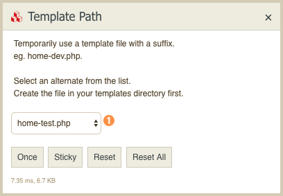

### User Dev Template Option
This is not reliant on the Template Path Panel, but its functionality is similar and its status is integrated into the panel, so it is presented here.

It makes it really easy to show authorized users development versions of template files. To make this work, all you need to do is enable the checkbox. Then setup a `tracy-template-****` permission and assign that to the required users.

Obviously this is not the best approach for major changes (you should set up a dev subdomain for that), but I think it could be quite handy for certain site changes.

Additionally, it automatically swaps out files included via `$config->prependTemplateFile` and `$config->appendTemplateFile` to use the same suffix at the replaced template, eg `_init-dev.php` or `_main-dev.php`

In this screenshot, you can see the reminder detailing why the icon is orange. Currently we are not viewing a page with an alternate template, but it is letting us know that:

* the "User Dev Template" option is enabled in module settings
* the `tracy-template-dev` (or `tracy-all-dev`) permission exists
* the permission has been assigned to at least one user
* there are template files with a "-dev" suffix

So if this is expected then great, but if not, then you can prevent the alternate templates from being rendered by doing one or more of the following:

* disabling the "User Dev Template" option
* removing the template-dev permission from the system
* remove the template-dev permission from all roles
* delete alternate template files with the "-dev" suffix

If you are on a page that is using an alternate template due to user permissions, then you will see the PW permission cog icon:

***

##  Template Resources
Displays the names, types, and values of all variables defined in the template file (and any other included files) for the current page. It also shows any defined constants and functions (linked to open in your code editor), as well as a list of included files (also linked to open in your code editor).

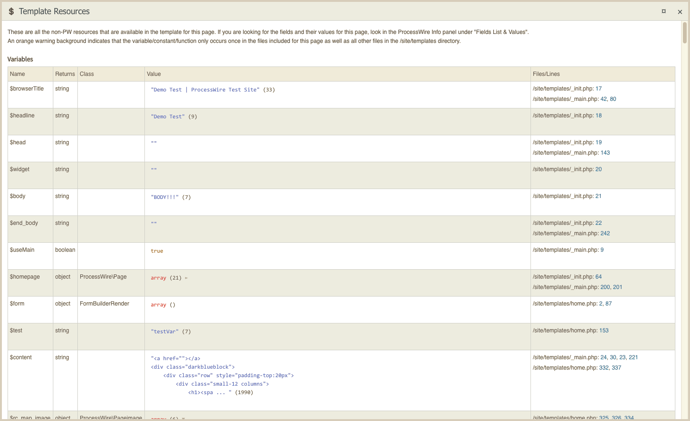

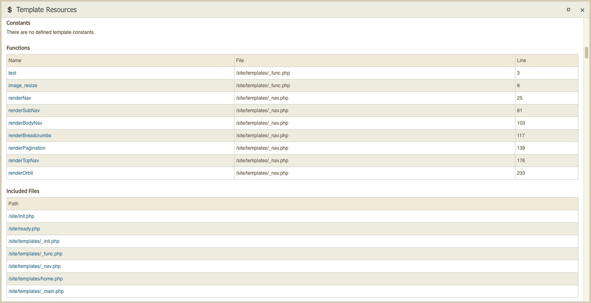

***

##  Todo
The ToDo Panel report the following comment types: 'todo', 'fixme', 'pending', 'xxx', 'hack', 'bug'. See the config settings for determining which folders and files will be scanned.

If you have your editor configured, the comment text link opens the file to the line of the comment.

The icon reports the number of items in the template file for the current file / the total number of items across all files.

* **Red:** there are items for the current page's template file.
* **Orange:** there are items in other files, but none in the current page's template file.
* **Green:** no items in any files under /site/templates/

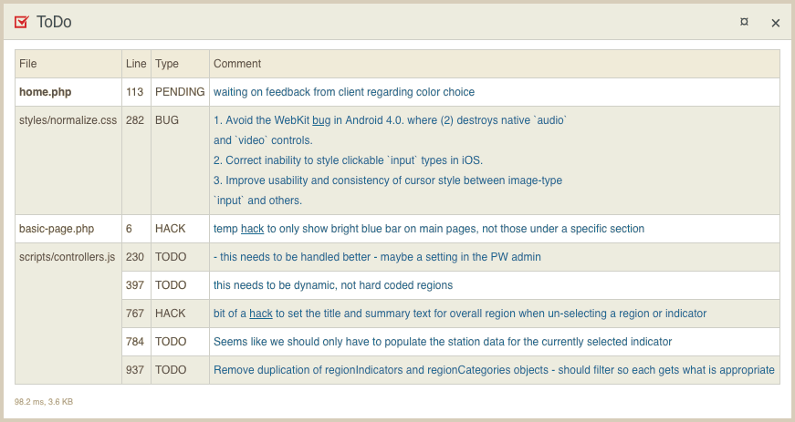

***

##  Tracy Logs
Displays the most recent entries from the Tracy log files. These log files can be written to automatically when Tracy is in Production mode, or manually using `TD::log()` or `l()` calls. Includes direct links to view each entry in your code editor. By default it shows the last 10, but this can be changed in the config settings. A red icon indicates the last page load contained an error, exception, or critical log entry. An orange icon is for all other log types.

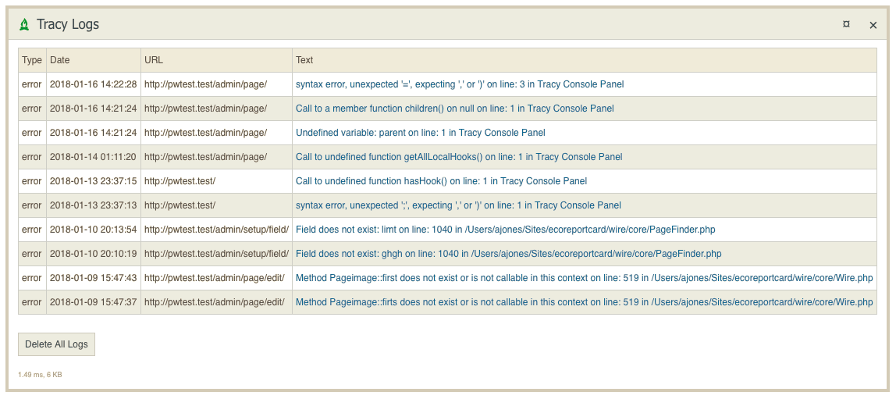

***

##  Tracy Toggler
Not really a panel, but this button on the debug bar lets you toggle Tracy on / off without needing to visit the module config settings. If you don't want another button always taking up room, you can also use the "Disable Tracy" button on the Panel Selector. Another alternative is the Hide/Show toggle icon at the far right of the debug bar, although this one doesn't actually turn Tracy off, but it gets the debug out of the way.

***

##  User Switcher
Allows you to instantly switch to any user in the system without knowing their password. After switching, you will still have full access to the Tracy debug bar, which can be very useful for debugging issues with other users and even guest (not logged in) visitors.

* You need to be a superuser to have access to the panel until a session is started, so even when Development mode is enabled, other users still won't be able to use it.
* It only works for the duration of user switcher session (max 60 minutes) and only a superuser can start a session.
* Starting the session makes use of PW's CSRF protection.
* The switcher session has a unique ID and expiry time which is stored in the database and must match the ID in the user's session.
* Once the session has expired, it is no longer possible to switch users. You can manually end the session, or if you forget it will expire automatically based on the session length you set.

As usual, icon colors are meaningful, telling you what type of user is currently logged in:
* Green: superuser
* Orange: non-superuser
* Red: guest / logged out

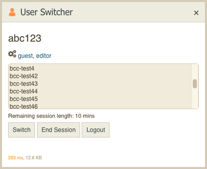

***

##  Users
Lists all the users/roles with access to the Tracy Debugger bar. A green debug bar icon indicates that only superusers can access the debug bar. An orange icon indicates that others have the tracy-debugger permission and may be able to see the debug bar. Another good reason to have the "Superuser Force Development Mode" option enabled because you will see this warning even in Production mode.

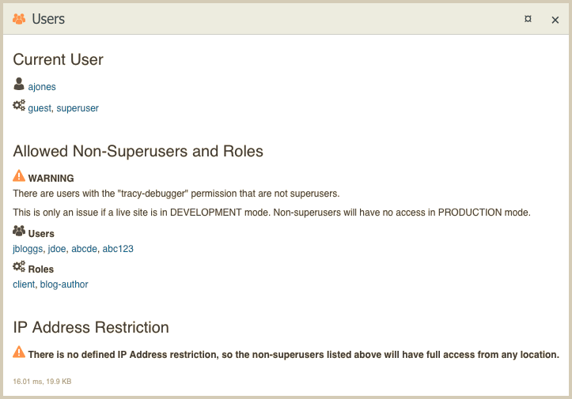

***

##  Validator
Validates the HTML of the page using the validator.nu service. This works with local development sites as well as live sites.

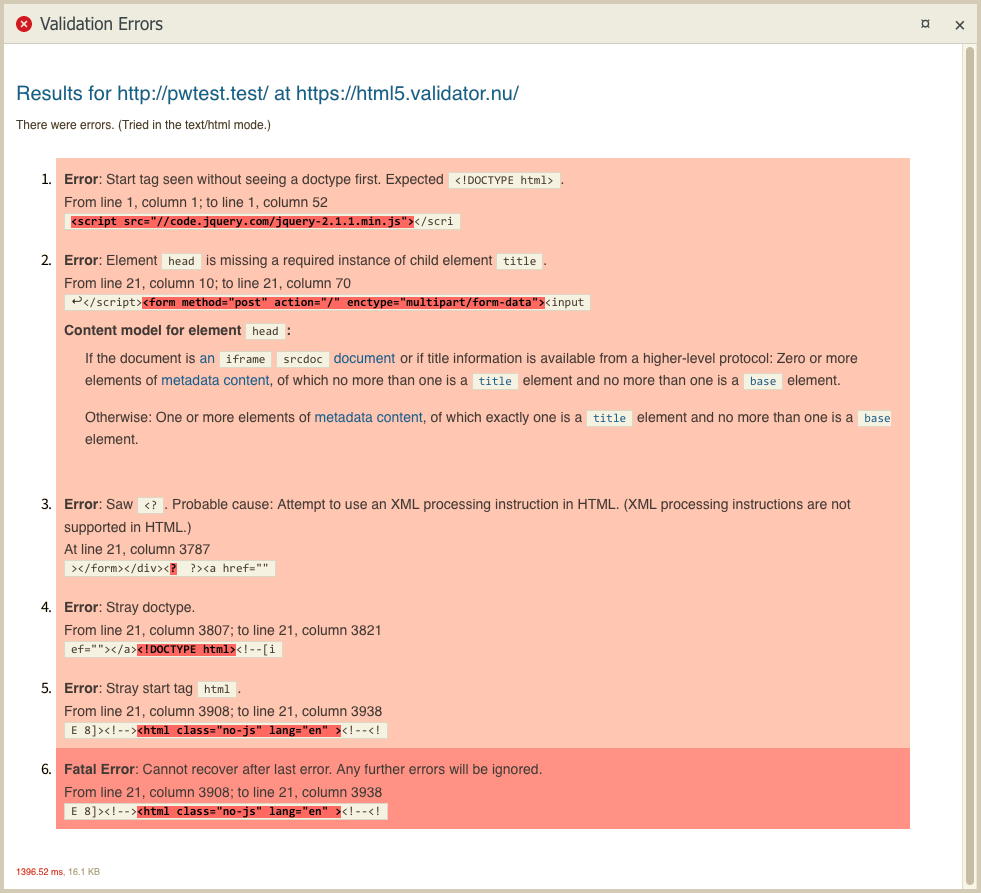

***
