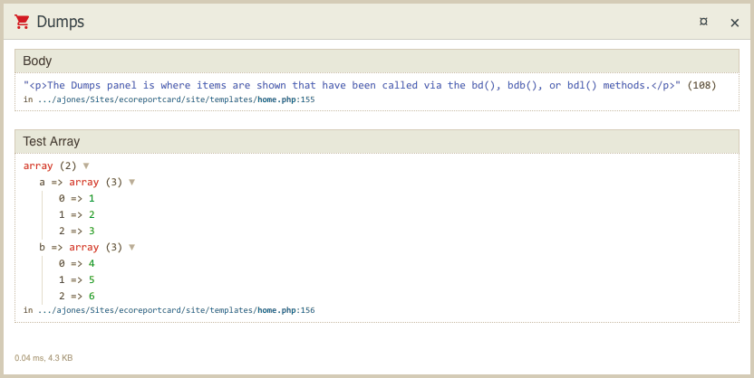
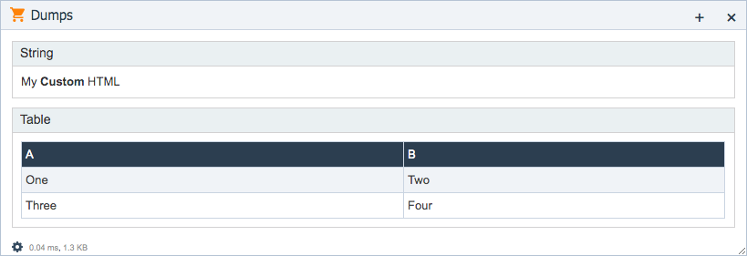

# Debug Methods

The debug methods have three options.

These show an example of each for the barDump method:
* TD::method() `TD::barDump()`
* method() `barDump()`
* shortcut() `bd()`

In most cases using the shortcut is the easiest option, although if you have a conflict with another method you may want to disable the shortcuts via the config settings and use the TD namespaced version.

### Copy dump output as Markdown

Every `bd()` / `d()` (and the big-variant) call renders a small "Copy as Markdown" button at the top-right of the dump. It copies a plaintext/markdown representation of the dumped value to the clipboard, formatted for pasting into a Claude or other AI agent prompt. Useful when you want an agent to reason about a `$page`, repeater, selector result, etc. without having to manually serialize it.

The same button appears on stack frames in the Tracy Exceptions panel.

## addBreakpoint

Method for use with the [Performance Panel](debug-bar.md#performance)

#### Parameters
```php
bp($name, $enforceParent);

/**
* @param string $name
* @param bool $enforceParent (default: false)
*/
```

***

## barDump

Most commonly used debug method. It dumps the variable to a dedicated panel on the debug bar.

#### Parameters
```php
bd($var, $title, $options);

/**
* @param mixed $var string|array|object to be dumped
* @param string $title string to identify this dump
* @param array $options | maxDepth (default:3), maxLength (default:150), maxItems (default:100)
*
* NOTE: default maxDepth, maxLength, and maxItems are configurable in the module config settings,
* but it is recommended to leave as is
*/
```

#### Options Examples

You can adjust the depth of array/objects, and the lengths of strings like this:

```php
bd($myArr, 'My Array', array('maxDepth' => 7, 'maxLength' => 0, 'maxItems' => 500));
// OR this shortcut
bd($myArr, 'My Array', [7,0, 500]);
```

This can be very handy when you have a deep array or very long string that you need to see more of without changing the defaults of maxDepth: 3, maxLength: 150, maxItems: 100 which can cause problems with PW objects if you go too high. Setting to '0' means no limit so don't do this on maxDepth when dumping a PW object - it won't be pretty!

#### Output Examples

Note the second optional parameter used to name the outputs in the Dumps panel.

```php
bd($page->body, 'Body');
bd(array('a' => array(1,2,3), 'b' => array(4,5,6)), 'Test Array');
```



See the **Body** and **Test Array** titles in the output?
Also, note the link to file and line number where these `bd()` calls were triggered. This is linked to open the file to that line in your code editor, the Tracy File Editor, or ProcessFileEdit, depending on your configuration.

***

## barDumpBig

The default `maxDepth`, `maxLength`, `maxItems` settings are set to 3, 150, and 100, respectively. This ensure faster rendering performance and is often all you need. You can of course use the `$options` parameter in `bd()` calls to adjust to your exact needs, but this method provides a quick shortcut to a "deeper and longer" version that should be enough in most circumstances.

Shortcut to `bd($var, $title, array('maxDepth' => 6, 'maxLength' => 9999, 'maxItems' => 250))`

#### Parameters
```php
bdb($var, $title, $options);

/**
* @param mixed $var string|array|object to be dumped
* @param string $title string to identify this dump
* @param array $options | maxDepth (default:3), maxLength (default:150), maxItems (default:100)
*/
```

***

## barEcho

Echos string directly to the dumps panel. It supports HTML.

#### Parameters
```php
be($var, $title, $options);

/**
* @param mixed $var string to be dumped
* @param string $title string to identify this dump
*
*/
```

#### Output Examples

Note the second optional parameter used to name the outputs in the Dumps panel.

```php
be('<p>My <strong>Custom</strong> HTML</p>', 'String');
be('<table><tr><th>A</th><th>B</th></tr><tr><td>One</td><td>Two</td></tr><tr><td>Three</td><td>Four</td></tr></table>', 'Table');
```



See the **String** title in the output?
Also, note the link to file and line number where these `be()` calls were triggered. This is linked to open the file to that line in your code editor, the Tracy File Editor, or ProcessFileEdit, depending on your configuration.

***

## debugAll

Shortcut for outputting via all the dump/log methods via the one call.

#### Parameters
```php
da($var, $title, $options);

/**
* @param mixed $var string|array|object to be dumped
* @param string $title string to identify this dump
* @param array $options | maxDepth (default:3), maxLength (default:150), maxItems (default:100)
*
* NOTE: default maxDepth, maxLength, and maxItems are configurable in the module config settings,
* but it is recommended to leave as is
*/
```


***

## dump

Unlike the barDump methods, this dumps the variable within the DOM of the page where it is called. Generally this method is inferior to the barDump methods, however it is the best option when using the [Console Panel](debug-bar.md#console).

#### Parameters
```php
d($var, $title, $options);

/**
* @param mixed $var string|array|object to be dumped
* @param string $title string to identify this dump
* @param array $options | maxDepth (default:3), maxLength (default:150), maxItems (default:100)
*
* NOTE: default maxDepth, maxLength, and maxItems are configurable in the module config settings,
* but it is recommended to leave as is
*/
```

***


## dumpBig

The default `maxDepth`, `maxLength`, and `maxItems` settings are set to 3, 150, and 100, respectively. This ensure faster rendering performance and is often all you need. You can of course use the `$options` parameter in `d()` calls to adjust to your exact needs, but this method provides a quick shortcut to a "deeper and longer" version that should be enough in most circumstances.

Shortcut to `d($var, $title, array('maxDepth' => 6, 'maxLength' => 9999, 'maxItems' => 250))`

#### Parameters
```php
db($var, $title, $options);

/**
* @param mixed $var string|array|object to be dumped
* @param string $title string to identify this dump
* @param array $options | maxDepth (default:3), maxLength (default:150), maxItems (default:100)
*/
```

***

## log

Useful if you want to store the results over multiple page requests.

#### Parameters
```php
l($var, $priority);

/**
* @param string $var string to be logged
* @param string $priority | "debug", "info", "warning", "error", "exception", "critical" (default: info)
*/
```
The priority setting reflects the name of the file that will be stored in /site/assets/logs/tracy/


***

## templateVars

Extracts just the template variables, removing all ProcessWire variables.

#### Parameters
```php
tv(get_defined_vars());
```

***

## timer

Determines time it takes to execute a block of code.

#### Parameters
```php
t($name)

/**
* @param string $name string
*/
```

#### Output Examples
```php
t();
// insert resource intensive code here
sleep(2);
bd(t());
```
You can also add an optional name parameter to each timer() call and then dump several at once in a single page load.

***

## sql

Returns the raw SQL query that ProcessWire would execute for a given selector. Useful for debugging why a `$pages->find()` isn't returning what you expect, or for getting a query you can paste straight into Adminer.

This method is only available on the `TD::` namespace — there is no shortcut alias.

#### Parameters
```php
TD::sql($selector);

/**
* @param string|array $selector PW selector string or array
* @return string SQL query
*/
```

#### Output Example
```php
bd(TD::sql('template=basic-page, title%=hello, sort=-created'));
```

***

## editLinks / viewLinks

Quick helpers for rendering a PageArray as a list of edit links (admin) or view links (frontend). Each link uses the page's title as the label.

These methods are only available on the `TD::` namespace.

#### Parameters
```php
TD::editLinks($pageArray);
TD::viewLinks($pageArray);

/**
* @param PageArray $pp
* @return string HTML — one link per line, separated by <br />
*/
```

#### Example
```php
bd(TD::editLinks($pages->find('template=basic-page, limit=10')), 'Recent pages');
```

***