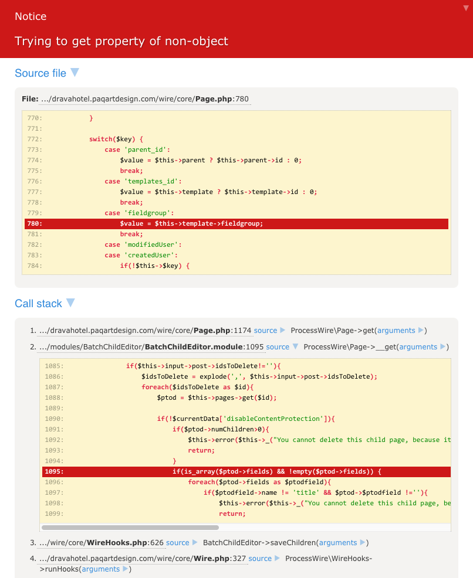
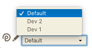

# Other Tools

## Bluescreen
The Tracy Bluescreen shows fatal errors complete with a call stack.

This is a real life example - in fact it is the reason I learned about Tracy. @tpr posted about a PHP Notice he was getting with my BatchChildEditor module - all he initially provided was:

PHP Notice: Trying to get property of non-object ... in Page.php:780
Not very helpful is it :) We know it's in the PW core Page.php file, but we don't know what is triggering it and I couldn't replicate it. Then he sent me the HTML of the Tracy debug output, which looked like the following (note - the call stack is truncated for brevity here):

From this I could quickly see a call from line #1095 of BatchChildEditor.module, so I expanded that and could see the exact line. From there it only took a second to realize that my check for is_array() was insufficient because it needed to check that $ptod was a valid PW page object.

> TIP: because the initial error is actually just a PHP Notice, Tracy needs to be put into Strict mode to see this full callstack. You can do this easily by clicking the "Enable Strict Mode" button on the Panel Selector.

***

## User Bar

> The User Bar allows you to give regular users (not guests), access to a bar with Admin, edit, and other custom links.

See the [configuration options](configuration.md#user-bar) for more details on the setup.

### Page Versions

The "Page versions" feature  allows an authorized user to select alternate versions of a page (different template files). This is a simplified version of the Debug Bar's Template Path panel that is available from the debug bar. It is also similar to the User Dev Template option, but this one allows the user to try multiple options that you provide. Remember you can always have the alternate template files load different js/css etc files as well, so you can provide a very different version of a page for your users to test. Additionally, it automatically swaps out files included via `$config->prependTemplateFile` and `$config->appendTemplateFile` to use the same suffix at the replaced template, eg `_init-dev.php` or `_main-dev.php`

To make it more friendly for your clients/editors, the labels in the list are formatted to look like page names, rather than filenames. The user simply selects an option and the page instantly refreshes showing the page using the alternate version. Even if you have the Page Versions option selected in the config settings, it won't appear on the User Bar unless you have alternately named template files matching this pattern: "home-alternate-one.php" etc. The key things are the name of the template, plus whatever you want to appear in the list of options, like "Alternate One", plus .php

Users must also have the "tracy-page-versions" permission assigned to their role.

***

## Adminer

When the companion [ProcessTracyAdminer](https://modules.processwire.com/modules/process-tracy-adminer/) module is installed, you also get a **Setup > Adminer** admin page (in addition to the [Adminer debug-bar panel](debug-bar.md#adminer)). The Setup-menu version is convenient when you want a larger working area than a Tracy panel provides — by default it runs inside the PW admin iframe, but you can switch to standalone mode in the config.

Adminer is auto-connected to the current PW database using credentials from `/site/config.php`, so no separate login is required. From within Tracy panels, several "open in Adminer" links jump you straight to the relevant table row (page, template, field, module).

Optional AI SQL assistants (Google Gemini and Open WebUI) can be enabled in the Adminer config to generate queries from natural-language prompts — see the [Adminer config section](configuration.md#adminer-panel) for details.

***

## Error notifications

When Tracy is in PRODUCTION mode, errors are written to `/site/assets/logs/tracy/` as full bluescreen HTML files. You can have Tracy push the same errors to:

* **Email** — set the "From" / "To" addresses under the Error logging section of the config. To avoid flooding your inbox after a single recurring error, Tracy writes an `email-sent` flag file after the first email; clear it by ticking the "Clear email sent flag" checkbox and saving.
* **Slack** — set a channel name and a Slack app OAuth token (`xoxb-…` with `chat:write` scope) and Tracy will post errors to that channel.

Both deliveries can be configured side-by-side.

***

## Permissions

Tracy uses a small set of PW permissions to control who sees what:

* **tracy-debugger** — grants non-superusers access to the Tracy debug bar (subject to the IP restriction setting, if any).
* **tracy-restricted-panels** — assign this as a role or permission to a user, then check the panels they should NOT see in the "Disabled panels for restricted users" config.
* **tracy-page-versions** — required to use the User Bar's Page Versions feature.

For the [User Dev Template feature](configuration.md#user-dev-template), Tracy looks for dynamic permissions named `tracy-{template}-{suffix}` (or `tracy-all-{suffix}` to enable across all templates). For example, with suffix `dev`, a permission named `tracy-basic-page-dev` would cause that user to render any `basic-page` using `basic-page-dev.php` instead.

***